# Kafka Consumer Blue/Green 배포 전략 설계서

> **버전:** v2.0
> **작성일:** 2026-02-18
> **적용 환경:** Kubernetes (온프레미스 / 클라우드 공통)

---

## 목차

1. [프로젝트 목표](#1-프로젝트-목표)
2. [핵심 도전과제](#2-핵심-도전과제)
3. [아키텍처 개요](#3-아키텍처-개요)
4. [배포 전략 비교 및 선택](#4-배포-전략-비교-및-선택)
5. [전략 A: 단일 Consumer Group + Cooperative Rebalance](#5-전략-a-단일-consumer-group--cooperative-rebalance)
6. [전략 B: 별도 Consumer Group + Offset 동기화](#6-전략-b-별도-consumer-group--offset-동기화)
7. [전략 C: Pause/Resume Atomic Switch](#7-전략-c-pauseresume-atomic-switch)
8. [전략 E: Kafka Connect REST API 기반](#8-전략-e-kafka-connect-rest-api-기반)
9. [다국어 Kafka Client Pause/Resume 지원 현황](#9-다국어-kafka-client-pauseresume-지원-현황)
10. [K8s 매니페스트 예시 (전략 B 기반)](#10-k8s-매니페스트-예시-전략-b-기반)
11. [Argo Rollouts 연동 (보조 전략)](#11-argo-rollouts-연동-보조-전략)
12. [운영 절차 (Runbook)](#12-운영-절차-runbook)
13. [모니터링 및 알람 설계](#13-모니터링-및-알람-설계)
14. [KIP-848 활용 전망](#14-kip-848-활용-전망)
15. [결론 및 권장사항](#15-결론-및-권장사항)
16. [참조 자료](#16-참조-자료)

---

## 1. 프로젝트 목표

| 목표 항목 | 설명 |
|-----------|------|
| **빠른 Blue/Green 전환** | 수 초 이내(< 30s) 컨슈머 트래픽 절체 |
| **즉시 롤백** | 이상 감지 시 1분 이내 이전 버전 복구 |
| **메시지 유실 Zero** | 전환 과정 중 Kafka 메시지 미처리 또는 중복 최소화 |
| **운영 자동화** | 수동 개입 없는 자동 헬스체크 기반 전환 |

---

## 2. 핵심 도전과제

Kafka Consumer의 Blue/Green 배포는 일반 HTTP 서비스와 근본적으로 다르다.

| 일반 HTTP 서비스 | Kafka Consumer |
|:---:|:---:|
| 로드밸런서로 트래픽 → X | 파티션 할당(Rebalance)으로 트래픽 |
| Ingress 전환으로 완료 | Consumer Group 상태 관리 필요 |
| Active/Standby 단순 | Partition Ownership 복잡성 |

**주요 문제점:**

- **Rebalance Stop-The-World:** Eager Rebalance 시 모든 컨슈머가 처리를 일시 중단
- **Partition Ownership 충돌:** Blue/Green이 동일 Group ID 사용 시 파티션 나눔 발생
- **Offset 동기화:** 전환 시점의 Offset 정합성 보장 필요
- **Pause/Resume 불안정성:** Rebalance 발생 시 Pause 상태가 초기화되는 문제 ([Confluent Kafka-Go #193](https://github.com/confluentinc/confluent-kafka-go/issues/193))

---

## 3. 아키텍처 개요

### 3.1 전체 구성도

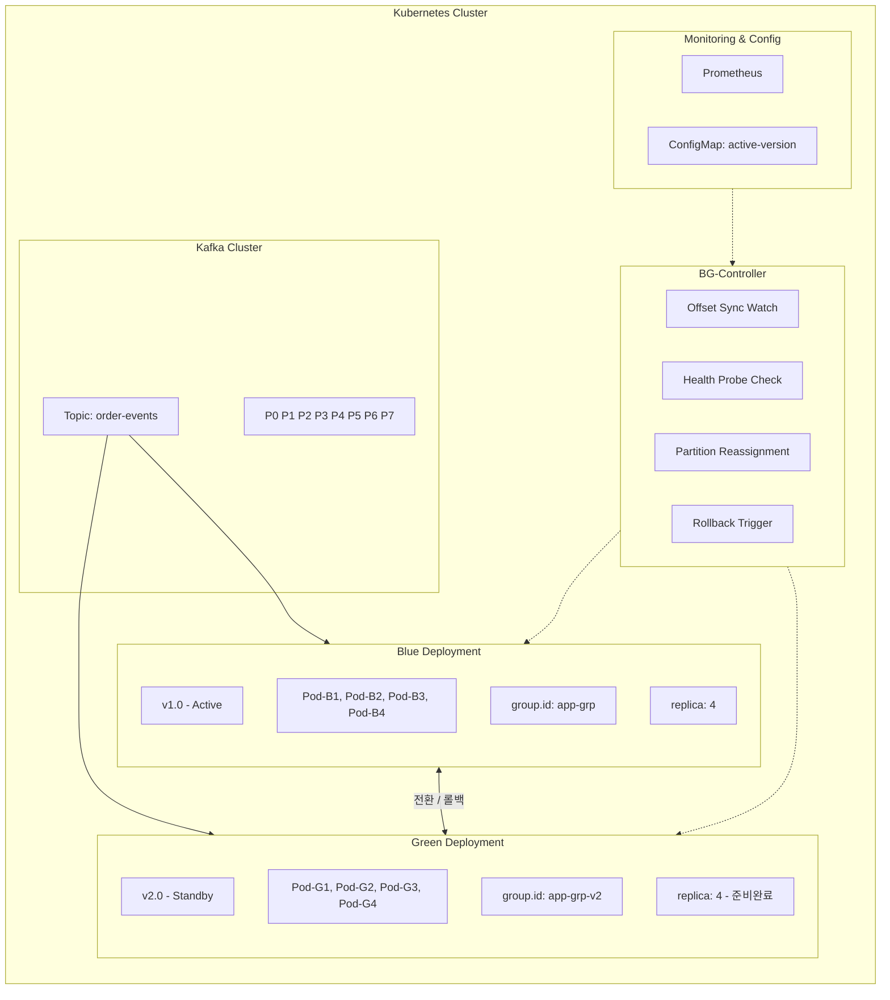

### 3.2 전환 흐름도

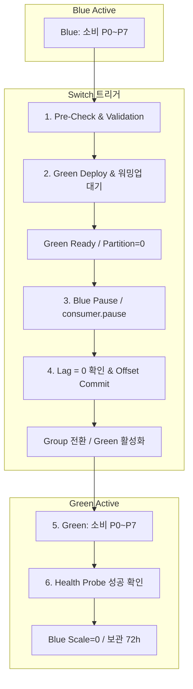

---

## 4. 배포 전략 비교 및 선택

### 4.1 전략 옵션 요약

| 전략 | Group ID | 전환 방식 | 전환 시간 | 메시지 안전성 | 복잡도 | 롤백 속도 |
|------|----------|-----------|-----------|---------------|--------|-----------|
| **A. 단일 Group + Cooperative Rebalance** | 공유 | 파티션 재분배 | 10~30초 | 높음 | 낮음 | 빠름 |
| **B. 별도 Group + Offset 동기화** | 분리 | Offset 복사 후 전환 | 30~120초 | 매우 높음 | 중간 | 중간 |
| **C. Pause/Resume + Atomic Switch** | 공유 | Pause → Group 전환 → Resume | 5~15초 | 최고 | 높음 | 매우 빠름 |
| **D. Shadow Consumer (Blackhole Sink)** | 분리 | 병렬 소비 → 검증 → 전환 | 분 단위 | 최고 | 매우 높음 | 빠름 |
| **E. Kafka Connect REST API** | 분리 | REST pause/resume | 2~5초 | 높음 | 중간 | 빠름 |

### 4.2 전략별 상세 비교

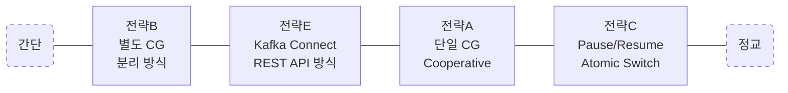

| 항목 | 전략 A: 단일 CG | 전략 B: CG 분리 | 전략 E: Kafka Connect | 전략 C: Pause/Resume Atomic |
|---|---|---|---|---|
| **전환 속도** | 10~30초 | 30초~2분 | **2~5초** | **1~3초** |
| **롤백 속도** | 빠름 | 30초~1분 | **2~5초** | **1~3초** |
| **메시지 중복/누락** | Rebalance 시 중복 | Offset 동기화로 최소화 | drain 후 최소화 | 드레인 시 최소화 |
| **앱 수정 필요** | ❌ 없음 | ❌ 없음 | ❌ **없음** | ⚠️ Pause/Resume 엔드포인트 |
| **인프라 복잡도** | 낮음 | 중간 | **중간 (JVM Worker 필요)** | 중간~높음 |
| **Rebalance 영향** | 전환마다 발생 | Green 시작 시 발생 | **프레임워크 내부 관리** | 미발생 (같은 인스턴스 유지) |
| **Thread-Safety** | 해당 없음 | 해당 없음 | ✅ **프레임워크 해결** | ⚠️ AtomicBoolean 필요 |
| **Pause 영구 저장** | 해당 없음 | 해당 없음 | ✅ **config topic 저장** | ❌ 인메모리 |
| **다국어 지원** | 모든 언어 | 모든 언어 | ⚠️ **Connector는 JVM** | ⚠️ 언어별 직접 구현 |
| **적합 시나리오** | 단순 프로덕션 | 일반 프로덕션 | **데이터 파이프라인형** | **빠른 전환 필요 프로덕션** |

### 4.3 권장 전략

> **운영 목표(빠른 전환 + 즉시 롤백)** 기준으로 **전략 C (Pause/Resume + Atomic Switch)** 를 커스텀 Consumer 워크로드의 주 전략으로 채택하고, **Kafka Connect 워크로드에는 전략 E**를 권장한다.

---

## 5. 전략 A: 단일 Consumer Group + Cooperative Rebalance

### 5.1 개요

Blue/Green이 **동일한 Consumer Group ID**를 사용하며, Cooperative Sticky Assignor를 통해 파티션을 점진적으로 Green으로 이전한다.

### 5.2 핵심 설정

```yaml
# Kafka Consumer 필수 설정
partition.assignment.strategy: CooperativeStickyAssignor  # 점진적 파티션 이전
group.instance.id: "${POD_NAME}"                          # Static Membership (K8s StatefulSet)
session.timeout.ms: 45000                                 # Pod 재시작 시 Rebalance 방지
heartbeat.interval.ms: 3000
max.poll.interval.ms: 300000
```

### 5.3 전환 순서

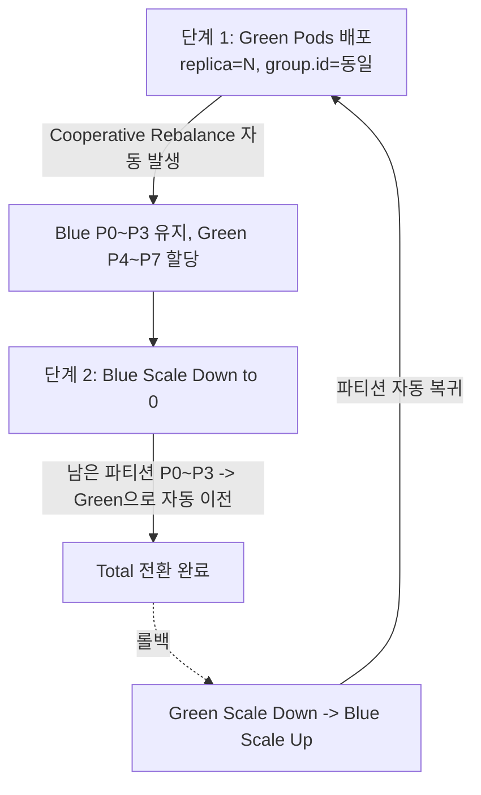

### 5.4 주의사항

- Blue와 Green의 `group.instance.id`가 겹치지 않도록 Pod명 기반 설정 필수
- Spring Kafka 버전 간 Rebalance Protocol 호환성 확인 필요 ([Spring Kafka #2277](https://github.com/spring-projects/spring-kafka/issues/2277))
- 토폴로지 변경이 큰 경우 Cooperative Rebalance 충돌 가능성 있음 ([Airwallex Engineering](https://medium.com/airwallex-engineering/kafka-streams-iterative-development-and-blue-green-deployment-fae88b26e75e))

---

## 6. 전략 B: 별도 Consumer Group + Offset 동기화

### 6.1 개요

Blue(`app-consumer-blue`)와 Green(`app-consumer-green`)이 **별도 Consumer Group**을 사용하며, Offset 동기화 후 트래픽을 전환한다.

### 6.2 파티션 전략 (Rebalancing Partition Technique)

파티션 수를 컨슈머 수의 2배 이상으로 구성하여 Blue/Green 모두 활성 소비 가능 상태를 만들 수 있다. ([Technical Disclosure Commons - Blue Green for Kafka](https://www.tdcommons.org/dpubs_series/6318/))

```
Topic Partitions: 8개
Blue Consumers: 4개  → 각 2 파티션
Green Consumers: 4개 → 각 2 파티션 (별도 Group으로 중복 소비)

전환 시: Green Group Offset = Blue Group 현재 Offset
         Blue Group Scale = 0
```

### 6.3 Offset 동기화 절차

```bash
# Green Consumer Group의 Offset을 Blue의 현재 값으로 강제 설정
kafka-consumer-groups.sh \
  --bootstrap-server kafka:9092 \
  --group app-consumer-green \
  --topic order-events \
  --reset-offsets \
  --to-offset <blue-current-offset> \
  --execute
```

### 6.4 ConfigMap 기반 Active 버전 관리

```yaml
# active-version ConfigMap으로 애플리케이션이 읽어 활성/비활성 결정
apiVersion: v1
kind: ConfigMap
metadata:
  name: kafka-consumer-active-version
data:
  active: "blue"        # "blue" | "green"
  switch-timestamp: ""
  rollback-allowed: "true"
```

---

## 7. 전략 C: Pause/Resume Atomic Switch

> 이 방식은 기존 Rebalance 방식의 한계를 극복하는 **독창적 설계**이다. Kafka Consumer API의 `pause()`/`resume()` 기능과 Kubernetes의 ConfigMap Watch를 결합하여, **Rebalance 없이** 컨슈머 소비를 원자적(Atomic)으로 전환한다.

### 7.1 Pause/Resume이 범용 도구화되지 않은 구조적 이유

광범위한 리서치를 통해 Pause/Resume 기반 Blue/Green 전환 방식은 **이론적으로 매우 유효하며, 실제로 이 방식을 구현한 사례가 존재**함을 확인했다. 그러나 범용 도구로 일반화되지 못한 데에는 구조적 이유들이 있다.

#### 발견된 유사 사례 및 도구

| 프로젝트/사례 | 방식 | 상태 |
|---|---|---|
| **Shawarma** (CenterEdge Software) | K8s Sidecar가 Service Endpoint 상태를 감시하여 HTTP POST로 앱에 active/inactive 통지 → 앱이 메시지 버스 처리를 시작/중지 | 오픈소스, 실제 프로덕션 사용. 단, .NET 에코시스템 중심 |
| **Spring Kafka Pause/Resume** | `KafkaListenerEndpointRegistry`를 통해 런타임에 Consumer를 pause/resume | Spring 프레임워크 내장 기능. 배포 오케스트레이션 도구와의 통합은 별도 구현 필요 |
| **Feature Flag 기반 Pause** (Improving사 사례) | Unleash 등 Feature Flag 도구로 poll loop 내에서 동적으로 pause/resume 제어 | 블로그 레벨 사례. 범용 도구화되지 않음 |
| **Lyft Blackhole Sink Pattern** | Flink/Kafka Streams에서 Blue/Green 전환 시 sink를 비활성화하여 출력 차단 | Flink Kubernetes Operator에 기여됨. Consumer가 아닌 Streaming Job 대상 |

> **참조**: [Shawarma GitHub](https://github.com/CenterEdge/shawarma) / [Shawarma 블로그](https://btburnett.com/kubernetes/microservices/continuous%20delivery/2019/08/12/shawarma.html) / [Feature Flag + Kafka](https://www.improving.com/thoughts/unleashing-feature-flags-onto-kafka-consumers/) / [Blackhole Sink Pattern](https://www.streamingdata.tech/p/blackhole-sink-pattern-for-blue-green)

#### 이유 1: Kafka Consumer의 Thread-Safety 제약

Kafka Consumer API는 **단일 스레드에서만 안전**하게 동작한다. 외부에서 HTTP 엔드포인트를 통해 pause/resume을 호출하면 `ConcurrentModificationException`이 발생한다.

```
java.util.ConcurrentModificationException: KafkaConsumer is not safe for multi-threaded access
```

이를 해결하려면 `AtomicBoolean` 플래그를 두고 poll loop 내에서 간접적으로 pause/resume을 실행해야 하며, 이는 프레임워크별로 구현 방식이 달라 범용화가 어렵다.

> **참조**: [Micronaut Kafka Issue #19](https://github.com/micronaut-projects/micronaut-kafka/issues/19) / [Red Hat Developer - Pause/Resume](https://developers.redhat.com/articles/2023/12/01/how-avoid-rebalances-and-disconnections-kafka-consumers)

#### 이유 2: Rebalance 시 Pause 상태 유실

Kafka Consumer의 `pause()`는 **파티션 할당에 종속적**이다. Consumer Group에서 rebalance가 발생하면:

- 기존에 pause된 파티션이 revoke되고 새로 assign될 때 **pause 상태가 리셋**된다
- 새로 할당된 파티션은 자동으로 resume 상태가 되어, **의도치 않게 메시지를 소비**할 수 있다

이 문제는 Spring Kafka 프로젝트에서도 공식 이슈로 등록되어 있다.

> **참조**: [Spring Kafka Issue #2222 - Do Not Resume Paused Partitions After Rebalance](https://github.com/spring-projects/spring-kafka/issues/2222) / [Confluent Kafka Go Issue #193](https://github.com/confluentinc/confluent-kafka-go/issues/193)

#### 이유 3: 애플리케이션 침투적(Intrusive) 설계

Pause/Resume 전환은 **Consumer 애플리케이션 코드에 변경이 필요**하다. HTTP 기반 트래픽 전환과 달리, 메시지 버스 Consumer에 대한 제어는 애플리케이션 내부에서 이루어져야 한다. 이는 다양한 프레임워크(Spring, Micronaut, Quarkus, Node.js 등)마다 별도 구현이 필요하여 범용 도구로 만들기 어렵다.

> Shawarma 프로젝트의 Brant Burnett도 이 점을 인식하고, Sidecar(인프라) + 간단한 HTTP 엔드포인트(앱)로 관심사를 분리하는 접근을 택했다.

#### 이유 4: Argo Rollouts의 명시적 한계

Argo Rollouts 공식 문서에서 다음과 같이 명시하고 있다:

> *"Argo Rollouts doesn't control traffic flow for connections it doesn't understand (i.e. binary/queue channels)."*

즉, HTTP/gRPC가 아닌 Kafka Consumer와 같은 pull 기반 워크로드에 대해서는 Argo Rollouts가 직접 제어하지 않는다. Blue/Green은 지원하지만, **파티션 할당이라는 Kafka 고유의 트래픽 라우팅**은 범위 밖이다.

> **참조**: [Argo Rollouts Concepts](https://argo-rollouts.readthedocs.io/en/stable/concepts/) / [Argo Rollouts Issue #3539](https://github.com/argoproj/argo-rollouts/issues/3539)

### 7.2 잠재적 문제점 및 대응 전략

#### Critical 위험요소

| # | 문제점 | 심각도 | 설명 |
|---|---|---|---|
| 1 | **Rebalance에 의한 Pause 상태 유실** | 🔴 Critical | 새 파티션 할당 시 pause 상태가 리셋되어 Blue/Green 양쪽 모두 소비 가능 |
| 2 | **Thread-Safety 위반** | 🔴 Critical | 외부 HTTP 호출로 직접 pause/resume 시 ConcurrentModificationException 발생 |
| 3 | **Pause 전파 지연** | 🟡 High | poll loop 주기에 따라 pause 명령 반영에 수 ms~수 초 지연 발생 가능 |
| 4 | **In-flight 메시지 처리** | 🟡 High | pause 시점에 이미 fetch된 메시지는 여전히 처리 중일 수 있어 완벽한 Atomic Switch 불가 |
| 5 | **같은 Consumer Group 사용 시 파티션 경합** | 🟡 High | Blue/Green이 동일 group.id를 사용하면 양쪽에 파티션이 분배됨 |
| 6 | **Offset 커밋 타이밍** | 🟡 High | pause 직전 처리 완료된 메시지의 offset 커밋이 보장되지 않으면 중복/누락 발생 |

#### 각 문제에 대한 대응 전략

**문제 1 대응 - Rebalance Listener 활용**:
```java
consumer.subscribe(topics, new ConsumerRebalanceListener() {
    @Override
    public void onPartitionsAssigned(Collection<TopicPartition> partitions) {
        if (shouldBePaused) {
            consumer.pause(partitions);  // 재할당 후에도 pause 유지
        }
    }
    @Override
    public void onPartitionsRevoked(Collection<TopicPartition> partitions) {
        consumer.commitSync();  // revoke 전 offset 확정
    }
});
```

**문제 2 대응 - 플래그 기반 간접 제어**:
```java
private final AtomicBoolean pauseRequested = new AtomicBoolean(false);

// Poll loop 내에서
while (running) {
    if (pauseRequested.compareAndSet(true, false)) {
        consumer.pause(consumer.assignment());
    }
    consumer.poll(Duration.ofMillis(100));
}

// HTTP 엔드포인트에서
@PostMapping("/pause")
public void pause() {
    pauseRequested.set(true);  // Thread-safe 플래그 설정
}
```

**문제 4 대응 - Graceful Drain**:
```
1. Blue에 pause 신호 전송
2. Blue가 현재 배치 처리 완료 대기 (drain timeout)
3. Blue의 offset commit 확인
4. Green에 resume 신호 전송
```

### 7.3 아키텍처 설계

```mermaid
flowchart TB
    Controller[Switch Controller\nK8s Custom Controller / Operator]
    Config[ConfigMap/CRD 감시\nactive: blue|green]

    subgraph Blue [Blue Deployment]
        direction TB
        subgraph BlueApp [Consumer App]
            B_Status[ACTIVE]
            B_Resume[resume 상태]
        end
        B_Sidecar[Sidecar\nShawarma형]
    end

    subgraph Green [Green Deployment]
        direction TB
        subgraph GreenApp [Consumer App]
            G_Status[PAUSED]
            G_Resume[pause 상태]
        end
        G_Sidecar[Sidecar\nShawarma형]
    end

    Topic((Kafka Topic))
    Group[Same Consumer Group\ngroup.id 공유 + Static Membership]

    Controller --> Config
    Config --> Blue
    Config --> Green
    BlueApp <--> Topic
    GreenApp <--> Topic
    BlueApp --- Group
    GreenApp --- Group
    B_Sidecar --- BlueApp
    G_Sidecar --- GreenApp
```

### 7.4 핵심 설계 결정

#### 결정 1: 같은 Consumer Group + Static Membership

Blue와 Green이 **같은 `group.id`를 사용**하되, `group.instance.id`(Static Membership, KIP-345)를 활용하여 rebalance를 최소화한다.

```yaml
# Blue Deployment - StatefulSet 사용
env:
  - name: KAFKA_GROUP_ID
    value: "my-consumer-group"
  - name: KAFKA_GROUP_INSTANCE_ID
    valueFrom:
      fieldRef:
        fieldPath: metadata.name  # e.g., consumer-blue-0, consumer-blue-1
```

**왜 같은 Consumer Group인가?**
- 별도 Consumer Group을 사용하면 전환 시 offset 동기화 문제가 발생
- 같은 Group + pause/resume으로 파티션 할당을 유지하면서 처리만 중단/재개

> **참조**: [KIP-345 Static Membership](https://cwiki.apache.org/confluence/display/KAFKA/KIP-345:+Introduce+static+membership+protocol+to+reduce+consumer+rebalances) / [Confluent - Consumer Group IDs](https://www.confluent.io/blog/configuring-apache-kafka-consumer-group-ids/)

#### 결정 2: Sidecar 패턴으로 관심사 분리

Shawarma의 접근법을 차용하여, Consumer 앱은 **단순한 HTTP 엔드포인트만 노출**하고, 인프라 레벨 판단은 Sidecar가 담당한다.

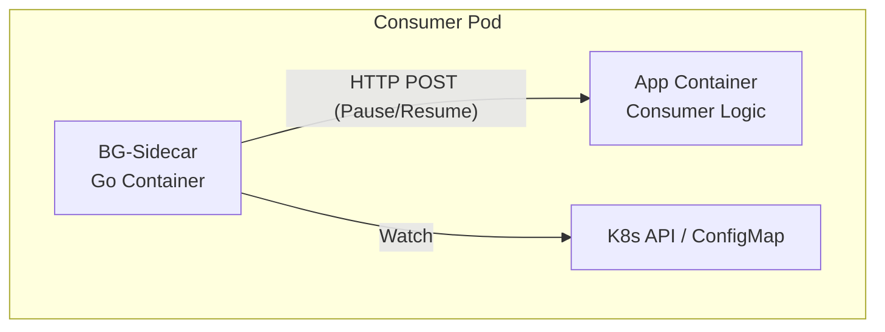

```
Consumer App의 책임:
  - POST /lifecycle/pause  → AtomicBoolean 플래그 설정 → poll loop에서 pause 실행
  - POST /lifecycle/resume → AtomicBoolean 플래그 설정 → poll loop에서 resume 실행
  - GET  /lifecycle/status → 현재 상태 반환 (ACTIVE/PAUSED/DRAINING)

Sidecar의 책임:
  - K8s ConfigMap/CRD 변경 감시
  - Consumer App에 HTTP POST로 상태 변경 통지
  - Consumer 상태 헬스체크 및 보고
```

#### 결정 3: Cooperative Sticky Assignor + Rebalance 방어

```properties
# Consumer 설정
partition.assignment.strategy=org.apache.kafka.clients.consumer.CooperativeStickyAssignor
session.timeout.ms=45000
heartbeat.interval.ms=15000
max.poll.interval.ms=300000
```

Rebalance 발생 시 pause 상태를 복구하는 방어 로직:

```java
@Override
public void onPartitionsAssigned(Collection<TopicPartition> partitions) {
    log.info("Partitions assigned: {}", partitions);
    if (lifecycleState == LifecycleState.PAUSED) {
        // Rebalance 후에도 pause 상태 유지
        consumer.pause(partitions);
        log.info("Re-paused assigned partitions due to PAUSED lifecycle state");
    }
}
```

> **참조**: [Confluent - Cooperative Rebalancing](https://www.confluent.io/blog/cooperative-rebalancing-in-kafka-streams-consumer-ksqldb/) / [Kafka 4.0 NGCRP](https://www.instaclustr.com/blog/rebalance-your-apache-kafka-partitions-with-the-next-generation-consumer-rebalance-protocol/)

### 7.5 전환 시퀀스 (Switch Sequence)

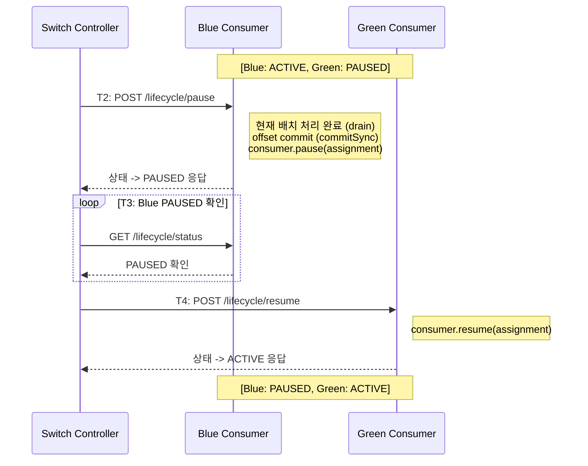

#### 롤백 시퀀스 (동일 메커니즘, 방향만 반대)

```
  T0: 운영자가 ConfigMap 업데이트 (active: blue)
  T1~T5: Green pause → Blue resume (동일 절차)
  총 롤백 시간: 1~3초
```

### 7.6 K8s 매니페스트

#### Switch Controller CRD

```yaml
apiVersion: kafka.example.com/v1alpha1
kind: KafkaConsumerSwitch
metadata:
  name: order-consumer-switch
  namespace: production
spec:
  consumerGroupId: order-processing-group
  activeColor: blue  # blue 또는 green
  blueDeployment:
    name: order-consumer-blue
    replicas: 3
  greenDeployment:
    name: order-consumer-green
    replicas: 3
  switchPolicy:
    drainTimeoutSeconds: 10
    healthCheckIntervalMs: 500
    rollbackOnFailure: true
status:
  currentActive: blue
  lastSwitchTime: "2026-02-17T10:30:00Z"
  blueStatus: ACTIVE
  greenStatus: PAUSED
```

#### Blue Deployment (StatefulSet + Sidecar)

```yaml
apiVersion: apps/v1
kind: StatefulSet
metadata:
  name: order-consumer-blue
  labels:
    app: order-consumer
    color: blue
spec:
  replicas: 3
  serviceName: order-consumer-blue
  selector:
    matchLabels:
      app: order-consumer
      color: blue
  template:
    metadata:
      labels:
        app: order-consumer
        color: blue
      annotations:
        kafka-switch.example.com/managed: "true"
    spec:
      containers:
        # Main Consumer Container
        - name: consumer
          image: myregistry/order-consumer:v2.1.0
          ports:
            - containerPort: 8080  # lifecycle 엔드포인트
          env:
            - name: KAFKA_BOOTSTRAP_SERVERS
              value: "kafka-cluster:9092"
            - name: KAFKA_GROUP_ID
              value: "order-processing-group"
            - name: KAFKA_GROUP_INSTANCE_ID
              valueFrom:
                fieldRef:
                  fieldPath: metadata.name
            - name: KAFKA_TOPICS
              value: "orders,order-updates"
            - name: INITIAL_STATE
              value: "ACTIVE"  # Blue 초기 상태
          readinessProbe:
            httpGet:
              path: /lifecycle/status
              port: 8080
            initialDelaySeconds: 10
            periodSeconds: 5
          livenessProbe:
            httpGet:
              path: /health
              port: 8080
            initialDelaySeconds: 15
            periodSeconds: 10
          resources:
            requests:
              cpu: 500m
              memory: 512Mi
            limits:
              cpu: 1000m
              memory: 1Gi

        # Switch Sidecar Container
        - name: switch-sidecar
          image: myregistry/kafka-switch-sidecar:v1.0.0
          env:
            - name: CONSUMER_LIFECYCLE_URL
              value: "http://localhost:8080/lifecycle"
            - name: SWITCH_CRD_NAME
              value: "order-consumer-switch"
            - name: MY_COLOR
              value: "blue"
            - name: MY_POD_NAME
              valueFrom:
                fieldRef:
                  fieldPath: metadata.name
            - name: MY_NAMESPACE
              valueFrom:
                fieldRef:
                  fieldPath: metadata.namespace
          resources:
            requests:
              cpu: 50m
              memory: 64Mi
            limits:
              cpu: 100m
              memory: 128Mi
```

#### Green Deployment (차이점만 표시)

```yaml
apiVersion: apps/v1
kind: StatefulSet
metadata:
  name: order-consumer-green
  labels:
    app: order-consumer
    color: green
spec:
  replicas: 3
  # ... (Blue와 동일 구조)
  template:
    spec:
      containers:
        - name: consumer
          image: myregistry/order-consumer:v2.2.0  # 새 버전
          env:
            # ... (동일)
            - name: INITIAL_STATE
              value: "PAUSED"  # Green 초기 상태 (대기)
        - name: switch-sidecar
          env:
            - name: MY_COLOR
              value: "green"  # 색상만 다름
```

### 7.7 Consumer App 구현 가이드 (Spring Kafka 예시)

```java
@RestController
@RequestMapping("/lifecycle")
public class ConsumerLifecycleController {

    private final KafkaListenerEndpointRegistry registry;
    private final AtomicReference<LifecycleState> state;

    @PostMapping("/pause")
    public ResponseEntity<Map<String, String>> pause() {
        state.set(LifecycleState.DRAINING);

        // 1. 현재 처리 중인 메시지 완료 대기
        awaitCurrentBatchCompletion();

        // 2. 모든 리스너 컨테이너 pause
        registry.getAllListenerContainers().forEach(container -> {
            if (container.isRunning()) {
                container.pause();
            }
        });

        state.set(LifecycleState.PAUSED);
        return ResponseEntity.ok(Map.of("status", "PAUSED"));
    }

    @PostMapping("/resume")
    public ResponseEntity<Map<String, String>> resume() {
        registry.getAllListenerContainers().forEach(container -> {
            if (container.isContainerPaused()) {
                container.resume();
            }
        });

        state.set(LifecycleState.ACTIVE);
        return ResponseEntity.ok(Map.of("status", "ACTIVE"));
    }

    @GetMapping("/status")
    public ResponseEntity<Map<String, Object>> status() {
        return ResponseEntity.ok(Map.of(
            "state", state.get().name(),
            "containers", getContainerStatuses()
        ));
    }
}
```

> **참조**: [Spring Kafka Pause/Resume 블로그](https://medium.com/@akhil.bojedla/start-stop-pause-and-resume-spring-kafka-consumer-at-runtime-45b44b9be44b) / [DZone - Stop & Resume Kafka](https://dzone.com/articles/ways-to-stop-amp-resume-your-kafka-producerconsume)

### 7.8 잔존 리스크 및 완화 방안

#### 리스크 매트릭스

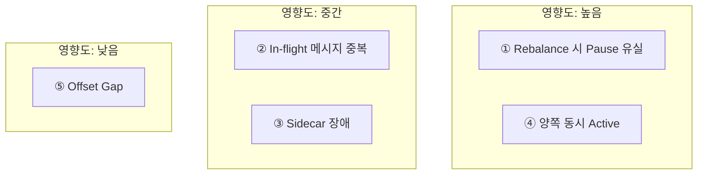

#### 양쪽 동시 Active 방지 (가장 중요한 안전장치)

Switch 과정에서 네트워크 지연이나 장애로 인해 Blue와 Green이 동시에 ACTIVE가 되는 상황을 방지해야 한다.

```yaml
# Distributed Lock을 활용한 안전장치
apiVersion: coordination.k8s.io/v1
kind: Lease
metadata:
  name: order-consumer-active-lease
  namespace: production
spec:
  holderIdentity: "blue"  # 현재 active인 색상
  leaseDurationSeconds: 30
  acquireTime: "2026-02-17T10:30:00Z"
  renewTime: "2026-02-17T10:30:25Z"
```

Switch Controller는 반드시 **"Pause First, Resume Second"** 원칙을 따른다:

```
1. Blue PAUSE 요청 → 응답 확인
2. Blue PAUSED 상태 검증 (GET /lifecycle/status)
3. Lease holder를 "green"으로 변경
4. Green RESUME 요청
5. Green ACTIVE 상태 검증
```

**만약 2단계에서 실패하면**: Blue는 ACTIVE를 유지하고, 전환을 중단한다.

---

## 8. 전략 E: Kafka Connect REST API 기반

### 8.1 핵심 아이디어: 프레임워크가 문제를 해결한다

앞서 분석한 Pause/Resume 방식의 4가지 구조적 문제(Thread-Safety, Rebalance Pause 유실, 앱 침투적 설계, Argo Rollouts 한계)에 대해, **Kafka Connect는 3가지를 프레임워크 레벨에서 이미 해결**하고 있다.

| 문제 | 일반 Consumer | Kafka Connect |
|:---:|:---:|:---:|
| Thread-Safety | ❌ 수동 우회 필요 | ✅ REST→config topic |
| Rebalance Pause 유실 | ❌ RebalanceListener | ✅ config topic 영구저장 |
| 앱 코드 수정 | ❌ 프레임워크별 별도 | ✅ Connector 수정 불필요 |
| Argo Rollouts 연동 | ❌ 커스텀 Sidecar | ⚠️ REST API로 용이 |

#### Thread-Safety → REST API + Config Topic 비동기 전파

일반 Consumer에서는 `KafkaConsumer`가 단일 스레드 전용이라 외부 HTTP 호출 시 `ConcurrentModificationException`이 발생한다. Kafka Connect는 **REST API 호출이 config topic(`connect-configs`)에 기록**되고, 각 Worker의 백그라운드 스레드가 이를 비동기로 소비하여 해당 Task를 안전하게 pause/resume한다.

```bash
# 어떤 언어, 어떤 환경에서든 동일하게 동작
curl -X PUT http://connect-worker:8083/connectors/my-sink/pause
curl -X PUT http://connect-worker:8083/connectors/my-sink/resume
curl -X GET http://connect-worker:8083/connectors/my-sink/status
```

> **참조**: [Confluent - Monitoring Connectors](https://docs.confluent.io/platform/current/connect/monitoring.html) / [Kafka Connect REST API 101](https://developer.confluent.io/courses/kafka-connect/rest-api/)

#### Rebalance Pause 유실 → Config Topic에 영구 저장

일반 Consumer의 `pause()`는 인메모리 상태이므로 rebalance 시 유실된다. Kafka Connect의 pause 상태는 **config topic에 영구 저장(persistent)**되어, Worker 재시작이나 rebalance 후에도 자동 복원된다.

> *"The pause state is persistent, so even if you restart the cluster, the connector will not begin message processing again until the task has been resumed."* — Confluent 공식 문서

> **참조**: [KIP-875: First-class Offsets Support](https://cwiki.apache.org/confluence/display/KAFKA/KIP-875:+First-class+offsets+support+in+Kafka+Connect)

#### 앱 침투적 설계 → Connector 코드 수정 불필요

일반 Consumer에서는 각 프레임워크(Spring, Micronaut, Node.js 등)마다 `/lifecycle/pause` 엔드포인트와 플래그 로직을 구현해야 한다. Kafka Connect에서는 **Connector/Task 코드에 아무런 수정 없이** 표준 REST API로 어떤 Connector든 동일하게 제어 가능하다.

### 8.2 아키텍처 개요

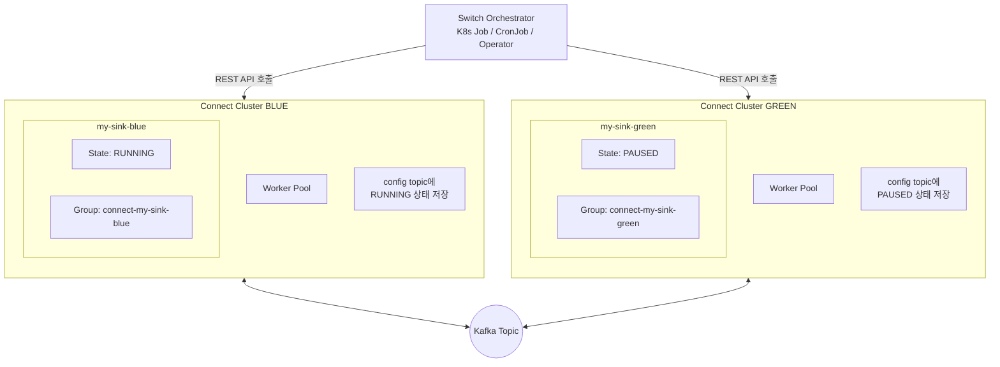

### 8.3 운영 모드

#### 모드 A: 단일 Connect Cluster + Connector 이름 분리

같은 Connect Cluster에서 Blue/Green Connector를 별도 이름으로 운영한다.

```bash
# Blue Connector 생성 (RUNNING)
curl -X POST http://connect:8083/connectors -H "Content-Type: application/json" -d '{
  "name": "my-sink-blue",
  "config": {
    "connector.class": "io.confluent.connect.jdbc.JdbcSinkConnector",
    "topics": "orders",
    "connection.url": "jdbc:postgresql://db:5432/orders",
    "tasks.max": "3",
    "consumer.override.group.id": "connect-my-sink-blue"
  }
}'

# Green Connector 생성 (STOPPED 상태로 생성 - KIP-980, Kafka 3.5+)
curl -X POST http://connect:8083/connectors -H "Content-Type: application/json" -d '{
  "name": "my-sink-green",
  "config": {
    "connector.class": "io.confluent.connect.jdbc.JdbcSinkConnector",
    "topics": "orders",
    "connection.url": "jdbc:postgresql://db:5432/orders",
    "tasks.max": "3",
    "consumer.override.group.id": "connect-my-sink-green"
  },
  "initial_state": "STOPPED"
}'
```

> **참조**: [KIP-980: Allow Creating Connectors in a Stopped State](https://cwiki.apache.org/confluence/display/KAFKA/KIP-980:+Allow+creating+connectors+in+a+stopped+state)

#### 모드 B: 별도 Connect Cluster (물리적 분리)

Blue/Green을 완전히 별도의 Connect Cluster로 운영하여 장애 격리를 강화한다.

```yaml
# Blue Connect Cluster (Strimzi 예시)
apiVersion: kafka.strimzi.io/v1beta2
kind: KafkaConnect
metadata:
  name: connect-blue
spec:
  replicas: 3
  bootstrapServers: kafka-cluster:9092
  config:
    group.id: connect-cluster-blue
    config.storage.topic: connect-configs-blue
    offset.storage.topic: connect-offsets-blue
    status.storage.topic: connect-status-blue
---
# Green Connect Cluster
apiVersion: kafka.strimzi.io/v1beta2
kind: KafkaConnect
metadata:
  name: connect-green
spec:
  replicas: 3
  bootstrapServers: kafka-cluster:9092
  config:
    group.id: connect-cluster-green
    config.storage.topic: connect-configs-green
    offset.storage.topic: connect-offsets-green
    status.storage.topic: connect-status-green
```

### 8.4 전환 시퀀스

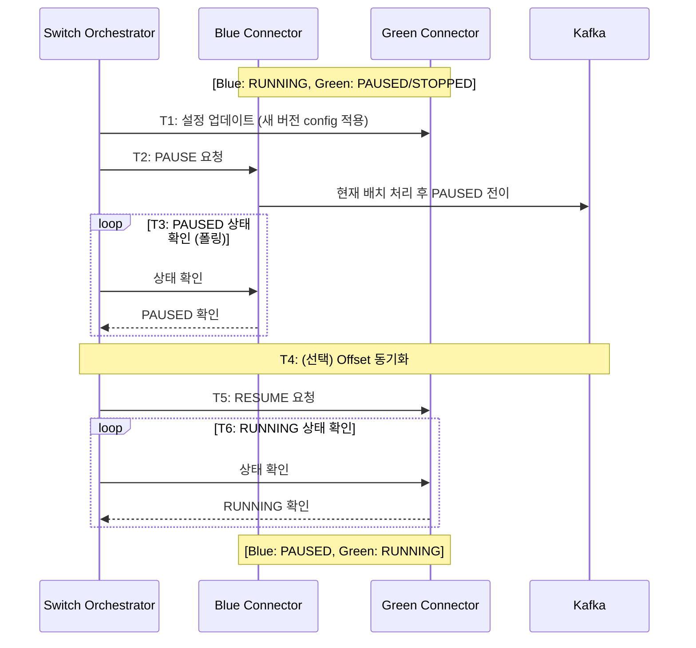

### 8.5 Offset 동기화 스크립트

```bash
#!/bin/bash
# switch-connector.sh - Kafka Connect Blue/Green 전환 스크립트

CONNECT_URL="http://connect-worker:8083"
BLUE_CONNECTOR="my-sink-blue"
GREEN_CONNECTOR="my-sink-green"
BLUE_GROUP="connect-my-sink-blue"
GREEN_GROUP="connect-my-sink-green"
KAFKA_BOOTSTRAP="kafka-cluster:9092"
TOPICS="orders"

echo "=== Step 1: Pause Blue Connector ==="
curl -s -X PUT "$CONNECT_URL/connectors/$BLUE_CONNECTOR/pause"

echo "=== Step 2: Wait for Blue PAUSED ==="
while true; do
  STATE=$(curl -s "$CONNECT_URL/connectors/$BLUE_CONNECTOR/status" | jq -r '.connector.state')
  echo "Blue state: $STATE"
  [ "$STATE" = "PAUSED" ] && break
  sleep 0.5
done

echo "=== Step 3: Get Blue's current offsets ==="
kafka-consumer-groups.sh --bootstrap-server $KAFKA_BOOTSTRAP \
  --group $BLUE_GROUP --describe --offsets 2>/dev/null > /tmp/blue-offsets.txt

echo "=== Step 4: Reset Green's offsets to match Blue ==="
# Green이 STOPPED 상태일 때만 offset reset 가능 (KIP-875)
curl -s -X PUT "$CONNECT_URL/connectors/$GREEN_CONNECTOR/stop"
sleep 2

# Kafka Connect 3.6+ REST API로 offset 조작
curl -s -X PATCH "$CONNECT_URL/connectors/$GREEN_CONNECTOR/offsets" \
  -H "Content-Type: application/json" \
  -d '{"offsets": [
    {"partition": {"kafka_topic": "orders", "kafka_partition": 0}, "offset": {"kafka_offset": 12345}},
    {"partition": {"kafka_topic": "orders", "kafka_partition": 1}, "offset": {"kafka_offset": 67890}}
  ]}'

echo "=== Step 5: Resume Green Connector ==="
curl -s -X PUT "$CONNECT_URL/connectors/$GREEN_CONNECTOR/resume"

echo "=== Step 6: Verify Green RUNNING ==="
while true; do
  STATE=$(curl -s "$CONNECT_URL/connectors/$GREEN_CONNECTOR/status" | jq -r '.connector.state')
  echo "Green state: $STATE"
  [ "$STATE" = "RUNNING" ] && break
  sleep 0.5
done

echo "=== Switch Complete ==="
```

> **참조**: [KIP-875: Offset Alter/Reset](https://cwiki.apache.org/confluence/display/KAFKA/KIP-875:+First-class+offsets+support+in+Kafka+Connect)

### 8.6 Strimzi Operator와의 통합 (Kubernetes Native)

Strimzi는 Kafka 3.5+부터 Connector의 STOPPED 상태를 CRD로 관리할 수 있다.

```yaml
# Blue Connector - Running
apiVersion: kafka.strimzi.io/v1beta2
kind: KafkaConnector
metadata:
  name: my-sink-blue
  labels:
    strimzi.io/cluster: connect-blue
spec:
  class: io.confluent.connect.jdbc.JdbcSinkConnector
  tasksMax: 3
  state: running          # ← Strimzi가 REST API 호출을 대행
  config:
    topics: orders
    connection.url: "jdbc:postgresql://db:5432/orders"
---
# Green Connector - Stopped
apiVersion: kafka.strimzi.io/v1beta2
kind: KafkaConnector
metadata:
  name: my-sink-green
  labels:
    strimzi.io/cluster: connect-green
spec:
  class: io.confluent.connect.jdbc.JdbcSinkConnector
  tasksMax: 3
  state: stopped           # ← 대기 상태
  config:
    topics: orders
    connection.url: "jdbc:postgresql://db:5432/orders"
```

전환 시 **`state` 필드만 변경**하면 Strimzi Operator가 자동으로 REST API를 호출한다:

```bash
# kubectl patch로 Blue/Green 전환
kubectl patch kafkaconnector my-sink-blue --type merge -p '{"spec":{"state":"stopped"}}'
kubectl patch kafkaconnector my-sink-green --type merge -p '{"spec":{"state":"running"}}'
```

> **참조**: [Strimzi Proposal #054 - Stopping Connectors](https://github.com/strimzi/proposals/blob/main/054-stopping-kafka-connect-connectors.md) / [Strimzi Issue #8713](https://github.com/strimzi/strimzi-kafka-operator/issues/8713)

### 8.7 주의사항: Strimzi REST API 직접 호출 vs CRD 제어 충돌

Strimzi 환경에서는 **REST API를 직접 호출하면 Strimzi Operator가 상태를 덮어쓸 수 있다**. Strimzi Issue #3277에서 보고된 바와 같이:

```
1. 사용자가 REST API로 pause 호출 → Connector PAUSED
2. Strimzi Operator가 주기적으로 CRD와 실제 상태를 reconcile
3. CRD에는 여전히 "running"으로 되어 있으므로 → 자동으로 RUNNING 복원
```

따라서 **Strimzi 환경에서는 반드시 CRD의 `spec.state`를 통해 제어**해야 한다.

> **참조**: [Strimzi Issue #3277 - REST API vs CRD Conflict](https://github.com/strimzi/strimzi-kafka-operator/issues/3277)

### 8.8 전략 E의 적합/부적합 시나리오

**적합한 경우:**
- Kafka → DB, Kafka → Elasticsearch, Kafka → S3 등 **데이터 파이프라인형 워크로드**
- 이미 Kafka Connect로 운영 중인 Sink/Source Connector
- 다양한 언어의 팀이 **통일된 운영 인터페이스**를 원하는 경우
- Strimzi 등 **Kubernetes Operator를 이미 사용** 중인 경우

**부적합한 경우:**
- Consumer 내부에 **복잡한 비즈니스 로직**(외부 API 호출, 복잡한 변환, 상태 관리)이 필요한 경우
- **JVM 의존성을 추가할 수 없는** 환경
- 기존 Connector 플러그인이 없는 커스텀 sink 대상

---

## 9. 다국어 Kafka Client Pause/Resume 지원 현황

### 9.1 언어별 Kafka 클라이언트 생태계

Kafka Connect가 적합하지 않아 직접 Consumer를 구현해야 하는 경우, 각 언어의 Kafka 클라이언트가 `pause()`/`resume()` API를 지원하는지가 Blue/Green 전략의 실현 가능성을 결정한다.

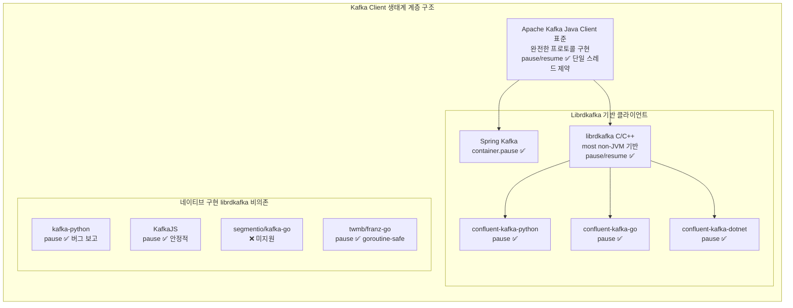

### 9.2 상세 비교표

| 언어 | 라이브러리 | pause/resume | Thread-Safety | Rebalance 후 pause 유지 | Blue/Green 적합도 | 비고 |
|---|---|---|---|---|---|---|
| **Java** | Apache Kafka Client | ✅ | ❌ 단일 스레드 | ❌ 수동 복구 필요 | ⭐⭐⭐⭐ | 표준 구현 |
| **Java** | Spring Kafka | ✅ `container.pause()` | ✅ 내부 관리 | ⚠️ [Issue #2222](https://github.com/spring-projects/spring-kafka/issues/2222) | ⭐⭐⭐⭐⭐ | 가장 추상화 우수 |
| **Python** | confluent-kafka-python | ✅ | ⚠️ librdkafka 부분 안전 | ❌ [Issue #371](https://github.com/confluentinc/confluent-kafka-python/issues/371) deadlock 보고 | ⭐⭐⭐ | librdkafka 래퍼 |
| **Python** | kafka-python | ✅ | ❌ 단일 스레드 | ❌ [Issue #2011](https://github.com/dpkp/kafka-python/issues/2011) offset 점프 버그 | ⭐⭐ | Pure Python, 유지보수 느림 |
| **Go** | confluent-kafka-go | ✅ | ⚠️ librdkafka 기반 | ❌ [Issue #193](https://github.com/confluentinc/confluent-kafka-go/issues/193) | ⭐⭐⭐ | CGO 의존성 |
| **Go** | segmentio/kafka-go | ❌ **미지원** | - | - | ⭐ | pause API 없음 |
| **Go** | twmb/franz-go | ✅ 부분 | ✅ goroutine-safe | ⚠️ 직접 구현 필요 | ⭐⭐⭐⭐ | 가장 현대적인 Go 클라이언트 |
| **Node.js** | KafkaJS | ✅ | ✅ 이벤트루프 단일스레드 | ⚠️ 직접 구현 필요 | ⭐⭐⭐⭐ | Node 특성상 thread-safety 자연 해결 |
| **Node.js** | node-rdkafka | ✅ | ⚠️ librdkafka 기반 | ❌ | ⭐⭐⭐ | KafkaJS보다 복잡 |
| **C#/.NET** | confluent-kafka-dotnet | ✅ | ⚠️ librdkafka 기반 | ❌ | ⭐⭐⭐ | [Shawarma](https://github.com/CenterEdge/shawarma)가 .NET 기반으로 검증 |
| **Rust** | rust-rdkafka | ✅ | ⚠️ librdkafka 기반 | ❌ | ⭐⭐⭐ | Rust 타입시스템으로 안전성 보강 |

> **참조**: [Apache Kafka Clients Wiki](https://cwiki.apache.org/confluence/display/KAFKA/Clients) / [Kafka Client Library Comparison](https://www.lydtechconsulting.com/blog/kafka-client-apache-kafka-vs-kafkajs)

### 9.3 librdkafka 기반 클라이언트의 공통 한계

Python, Go, C#, Rust 등 non-JVM 언어의 주요 클라이언트는 대부분 **librdkafka(C/C++)를 래핑**한다. 이들은 모두 `pause()`/`resume()`를 지원하지만, **Kafka Connect가 프레임워크 레벨에서 해결해 주는 3가지 문제는 여전히 수동 구현이 필요**하다:

1. **Rebalance 시 pause 유실** → 모든 언어에서 `on_assign` 콜백에서 수동 re-pause 로직 필요
2. **영구 저장 없음** → pause 상태가 인메모리. 프로세스 재시작 시 외부 저장소에서 복구 필요
3. **앱 침투적** → 각 언어/프레임워크마다 HTTP 엔드포인트 + 플래그 로직을 직접 구현

### 9.4 비-JVM 언어를 위한 권장 경로

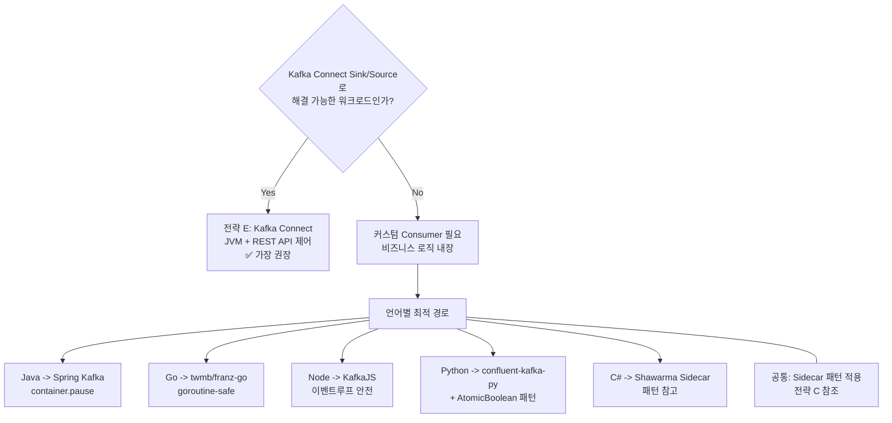

### 9.5 Kafka Connect 동등 프레임워크 부재

Kafka Connect의 핵심 가치(관리형 lifecycle, persistent pause, REST API, config topic 기반 분산 조정)를 동등하게 제공하는 **non-JVM 프레임워크는 현재 존재하지 않는다**.

| 프로젝트 | 언어 | 상태 | Kafka Connect 대비 |
|---|---|---|---|
| [amient/goconnect](https://github.com/amient/goconnect) | Go | ⚠️ 실험적, 비활성 | at-least-once 보장만. pause/resume lifecycle 없음 |
| [networknt/kafka-sidecar](https://github.com/networknt/kafka-sidecar) | Java (Sidecar) | 활성 | HTTP↔Kafka 브릿지. lifecycle 관리 아님 |
| Confluent REST Proxy | Java (서비스) | 프로덕션 가능 | produce/consume만. pause/resume lifecycle 없음 |

> **참조**: [Kafka Connect Tutorial - Why Not Write Your Own](https://developer.confluent.io/courses/kafka-connect/intro/) / [Confluent Kafka Go Client](https://github.com/confluentinc/confluent-kafka-go)

---

## 10. K8s 매니페스트 예시 (전략 B 기반)

> 전략 C의 매니페스트는 [7.6절](#76-k8s-매니페스트)을, 전략 E의 매니페스트는 [8.3절](#83-운영-모드)을 참고한다.

### 10.1 Blue Deployment (현재 활성)

```yaml
apiVersion: apps/v1
kind: Deployment
metadata:
  name: order-consumer-blue
  namespace: kafka-consumers
  labels:
    app: order-consumer
    version: blue
    environment: production
spec:
  replicas: 4
  selector:
    matchLabels:
      app: order-consumer
      version: blue
  template:
    metadata:
      labels:
        app: order-consumer
        version: blue
      annotations:
        prometheus.io/scrape: "true"
        prometheus.io/port: "8080"
        prometheus.io/path: "/actuator/prometheus"
    spec:
      terminationGracePeriodSeconds: 60  # graceful shutdown 보장
      containers:
      - name: order-consumer
        image: registry.example.com/order-consumer:v1.0.0
        ports:
        - containerPort: 8080
          name: http
        env:
        - name: KAFKA_BOOTSTRAP_SERVERS
          value: "kafka-broker:9092"
        - name: KAFKA_GROUP_ID
          value: "order-consumer-blue"
        - name: KAFKA_GROUP_INSTANCE_ID
          valueFrom:
            fieldRef:
              fieldPath: metadata.name    # Pod명으로 Static Membership
        - name: KAFKA_AUTO_OFFSET_RESET
          value: "earliest"
        - name: KAFKA_PARTITION_ASSIGNMENT_STRATEGY
          value: "org.apache.kafka.clients.consumer.CooperativeStickyAssignor"
        - name: BG_ACTIVE_VERSION
          valueFrom:
            configMapKeyRef:
              name: kafka-consumer-active-version
              key: active
        resources:
          requests:
            memory: "512Mi"
            cpu: "500m"
          limits:
            memory: "1Gi"
            cpu: "1000m"
        livenessProbe:
          httpGet:
            path: /actuator/health/liveness
            port: 8080
          initialDelaySeconds: 30
          periodSeconds: 10
          failureThreshold: 3
        readinessProbe:
          httpGet:
            path: /actuator/health/readiness
            port: 8080
          initialDelaySeconds: 20
          periodSeconds: 5
          failureThreshold: 3
        lifecycle:
          preStop:
            exec:
              command: ["/bin/sh", "-c", "sleep 10"]  # graceful drain
---
apiVersion: v1
kind: Service
metadata:
  name: order-consumer-blue-svc
  namespace: kafka-consumers
spec:
  selector:
    app: order-consumer
    version: blue
  ports:
  - name: http
    port: 8080
    targetPort: 8080
  type: ClusterIP
```

### 10.2 Green Deployment (신 버전 대기)

```yaml
apiVersion: apps/v1
kind: Deployment
metadata:
  name: order-consumer-green
  namespace: kafka-consumers
  labels:
    app: order-consumer
    version: green
    environment: production
spec:
  replicas: 0  # 초기 비활성 (전환 시 4로 변경)
  selector:
    matchLabels:
      app: order-consumer
      version: green
  template:
    metadata:
      labels:
        app: order-consumer
        version: green
      annotations:
        prometheus.io/scrape: "true"
        prometheus.io/port: "8080"
        prometheus.io/path: "/actuator/prometheus"
    spec:
      terminationGracePeriodSeconds: 60
      containers:
      - name: order-consumer
        image: registry.example.com/order-consumer:v2.0.0  # 신 버전
        ports:
        - containerPort: 8080
          name: http
        env:
        - name: KAFKA_BOOTSTRAP_SERVERS
          value: "kafka-broker:9092"
        - name: KAFKA_GROUP_ID
          value: "order-consumer-green"     # 별도 Group ID
        - name: KAFKA_GROUP_INSTANCE_ID
          valueFrom:
            fieldRef:
              fieldPath: metadata.name
        - name: KAFKA_AUTO_OFFSET_RESET
          value: "none"  # 반드시 외부에서 Offset 주입
        - name: KAFKA_PARTITION_ASSIGNMENT_STRATEGY
          value: "org.apache.kafka.clients.consumer.CooperativeStickyAssignor"
        - name: BG_ACTIVE_VERSION
          valueFrom:
            configMapKeyRef:
              name: kafka-consumer-active-version
              key: active
        resources:
          requests:
            memory: "512Mi"
            cpu: "500m"
          limits:
            memory: "1Gi"
            cpu: "1000m"
        livenessProbe:
          httpGet:
            path: /actuator/health/liveness
            port: 8080
          initialDelaySeconds: 30
          periodSeconds: 10
        readinessProbe:
          httpGet:
            path: /actuator/health/readiness
            port: 8080
          initialDelaySeconds: 20
          periodSeconds: 5
```

### 10.3 Active 버전 ConfigMap

```yaml
apiVersion: v1
kind: ConfigMap
metadata:
  name: kafka-consumer-active-version
  namespace: kafka-consumers
  labels:
    app: order-consumer
    managed-by: bg-controller
data:
  active: "blue"                    # "blue" | "green"
  switch-timestamp: ""
  previous-version: ""
  rollback-allowed: "true"
  rollback-window: "3600"          # 롤백 허용 시간(초), 1시간
```

### 10.4 BG-Switch Controller Job

```yaml
apiVersion: batch/v1
kind: Job
metadata:
  name: bg-switch-controller
  namespace: kafka-consumers
spec:
  template:
    spec:
      serviceAccountName: bg-controller-sa
      restartPolicy: Never
      containers:
      - name: bg-controller
        image: registry.example.com/bg-controller:latest
        env:
        - name: KAFKA_BOOTSTRAP_SERVERS
          value: "kafka-broker:9092"
        - name: BLUE_SERVICE
          value: "order-consumer-blue-svc.kafka-consumers.svc.cluster.local:8080"
        - name: GREEN_SERVICE
          value: "order-consumer-green-svc.kafka-consumers.svc.cluster.local:8080"
        - name: TARGET_VERSION
          value: "green"            # 전환 대상
        - name: LAG_THRESHOLD
          value: "0"                # Lag=0 확인 후 전환
        - name: HEALTH_CHECK_RETRIES
          value: "10"
        - name: NAMESPACE
          value: "kafka-consumers"
---
# BG Controller ServiceAccount & RBAC
apiVersion: v1
kind: ServiceAccount
metadata:
  name: bg-controller-sa
  namespace: kafka-consumers
---
apiVersion: rbac.authorization.k8s.io/v1
kind: Role
metadata:
  name: bg-controller-role
  namespace: kafka-consumers
rules:
- apiGroups: ["apps"]
  resources: ["deployments", "deployments/scale"]
  verbs: ["get", "list", "update", "patch"]
- apiGroups: [""]
  resources: ["configmaps"]
  verbs: ["get", "list", "update", "patch"]
- apiGroups: [""]
  resources: ["pods"]
  verbs: ["get", "list"]
---
apiVersion: rbac.authorization.k8s.io/v1
kind: RoleBinding
metadata:
  name: bg-controller-rolebinding
  namespace: kafka-consumers
subjects:
- kind: ServiceAccount
  name: bg-controller-sa
  namespace: kafka-consumers
roleRef:
  kind: Role
  name: bg-controller-role
  apiGroup: rbac.authorization.k8s.io
```

### 10.5 KEDA ScaledObject (Kafka Lag 기반 자동 스케일링)

```yaml
# KEDA로 Consumer Lag에 따른 자동 스케일링 (전환 후 Green에 적용)
apiVersion: keda.sh/v1alpha1
kind: ScaledObject
metadata:
  name: order-consumer-green-scaler
  namespace: kafka-consumers
spec:
  scaleTargetRef:
    name: order-consumer-green
  minReplicaCount: 2
  maxReplicaCount: 8
  triggers:
  - type: kafka
    metadata:
      bootstrapServers: kafka-broker:9092
      consumerGroup: order-consumer-green
      topic: order-events
      lagThreshold: "100"           # Lag 100 초과 시 스케일 업
      offsetResetPolicy: earliest
```

---

## 11. Argo Rollouts 연동 (보조 전략)

Pause/Resume Atomic Switch를 Argo Rollouts의 Blue/Green 전략과 결합할 수 있다. 단, Argo Rollouts가 Kafka 파티션 할당을 직접 제어하지는 못하므로, **별도 Consumer Group 사용이 필요**하다.

```yaml
apiVersion: argoproj.io/v1alpha1
kind: Rollout
metadata:
  name: order-consumer-rollout
  namespace: kafka-consumers
spec:
  replicas: 4
  selector:
    matchLabels:
      app: order-consumer
  template:
    metadata:
      labels:
        app: order-consumer
    spec:
      terminationGracePeriodSeconds: 60
      containers:
      - name: order-consumer
        image: registry.example.com/order-consumer:v2.0.0
        env:
        - name: KAFKA_GROUP_INSTANCE_ID
          valueFrom:
            fieldRef:
              fieldPath: metadata.name
  strategy:
    blueGreen:
      activeService: order-consumer-active-svc
      previewService: order-consumer-preview-svc
      autoPromotionEnabled: false   # 수동 승인 후 전환
      scaleDownDelaySeconds: 600    # 전환 후 10분간 Blue 유지 (롤백 대비)
      prePromotionAnalysis:
        templates:
        - templateName: kafka-consumer-health-check
        args:
        - name: service-name
          value: order-consumer-preview-svc
      postPromotionAnalysis:
        templates:
        - templateName: kafka-lag-analysis
---
# 사전 전환 분석 템플릿
apiVersion: argoproj.io/v1alpha1
kind: AnalysisTemplate
metadata:
  name: kafka-consumer-health-check
  namespace: kafka-consumers
spec:
  args:
  - name: service-name
  metrics:
  - name: consumer-error-rate
    interval: 30s
    count: 5
    successCondition: result[0] < 0.01    # 에러율 1% 미만
    provider:
      prometheus:
        address: http://prometheus:9090
        query: |
          rate(kafka_consumer_errors_total{
            service="{{args.service-name}}"
          }[2m])
```

> **참조**: [Argo Rollouts Blue/Green](https://argo-rollouts.readthedocs.io/en/stable/features/bluegreen/) / [Argo Rollouts Traffic Management](https://argo-rollouts.readthedocs.io/en/stable/features/traffic-management/)

---

## 12. 운영 절차 (Runbook)

### 12.1 사전 준비 체크리스트

```
배포 전 확인사항 (D-1)
──────────────────────────────────────────────────────
□ Green 이미지 빌드 완료 및 레지스트리 등록 확인
□ 스테이징 환경에서 Green 버전 기능 검증 완료
□ Blue Consumer Lag 정상 수준 확인 (< 100)
□ Kafka 브로커 상태 정상 확인
□ Prometheus/Grafana 모니터링 대시보드 접근 확인
□ 롤백 절차 숙지 및 담당자 대기
□ 작업 시간대 확인 (저트래픽 시간대 권장)
```

### 12.2 Blue → Green 전환 절차 (상세)

```
STEP 1: Green 배포 준비 (예상 소요: 3~5분)
────────────────────────────────────────────
1.1 Green Deployment image 업데이트
    kubectl set image deployment/order-consumer-green \
      order-consumer=registry.example.com/order-consumer:v2.0.0 \
      -n kafka-consumers

1.2 Green Deployment Replica 확장
    kubectl scale deployment order-consumer-green \
      --replicas=4 -n kafka-consumers

1.3 Green Pod 기동 완료 확인 (모든 Pod Ready 상태)
    kubectl rollout status deployment/order-consumer-green \
      -n kafka-consumers

1.4 Green 애플리케이션 자체 헬스체크 확인
    kubectl exec -n kafka-consumers \
      $(kubectl get pod -l version=green -n kafka-consumers \
        -o jsonpath='{.items[0].metadata.name}') \
      -- curl -s localhost:8080/actuator/health | jq .

    ✅ 기대 결과: {"status":"UP"}

────────────────────────────────────────────
STEP 2: Blue Consumer Pause (예상 소요: 1~2분)
────────────────────────────────────────────
2.1 Blue 모든 Pod에 Pause 신호 전송
    for pod in $(kubectl get pods -n kafka-consumers \
      -l version=blue -o name); do
      kubectl exec -n kafka-consumers $pod -- \
        curl -X POST localhost:8080/actuator/kafka/pause
    done

2.2 Blue Consumer Lag 소진 확인 (Lag = 0 대기)
    # 30초 간격으로 Lag 모니터링 (최대 5분 대기)
    watch -n 5 "kafka-consumer-groups.sh \
      --bootstrap-server kafka-broker:9092 \
      --group order-consumer-blue \
      --describe | grep order-events"

    ✅ 기대 결과: LAG 컬럼 = 0

    ⚠️  5분 내 Lag 미소진 시: STEP 2 대기 연장 또는 중단 검토

────────────────────────────────────────────
STEP 3: Green Offset 동기화 (예상 소요: 1분)
────────────────────────────────────────────
3.1 Blue Consumer 현재 Offset 스냅샷 저장
    kafka-consumer-groups.sh \
      --bootstrap-server kafka-broker:9092 \
      --group order-consumer-blue \
      --describe > /tmp/blue-offset-snapshot-$(date +%Y%m%d%H%M%S).txt

3.2 Green Consumer Group Offset을 Blue 현재값으로 동기화
    kafka-consumer-groups.sh \
      --bootstrap-server kafka-broker:9092 \
      --group order-consumer-green \
      --topic order-events \
      --reset-offsets \
      --to-current \
      --execute

3.3 Offset 동기화 결과 확인
    kafka-consumer-groups.sh \
      --bootstrap-server kafka-broker:9092 \
      --group order-consumer-green \
      --describe

────────────────────────────────────────────
STEP 4: Active 버전 전환 (예상 소요: 10초)
────────────────────────────────────────────
4.1 ConfigMap 업데이트 (활성 버전: blue → green)
    kubectl patch configmap kafka-consumer-active-version \
      -n kafka-consumers \
      --type merge \
      -p '{"data":{"active":"green",
                    "previous-version":"blue",
                    "switch-timestamp":"'"$(date -u +%Y-%m-%dT%H:%M:%SZ)"'"}}'

4.2 Green Consumer 활성화 확인
    kubectl exec -n kafka-consumers \
      $(kubectl get pod -l version=green -n kafka-consumers \
        -o jsonpath='{.items[0].metadata.name}') \
      -- curl -s localhost:8080/actuator/kafka/status | jq .

    ✅ 기대 결과: {"paused": false, "assignedPartitions": [...]}

────────────────────────────────────────────
STEP 5: 전환 후 검증 (예상 소요: 5~10분)
────────────────────────────────────────────
5.1 Green Consumer Lag 모니터링
    watch -n 5 "kafka-consumer-groups.sh \
      --bootstrap-server kafka-broker:9092 \
      --group order-consumer-green \
      --describe"

    ✅ 기대 결과: LAG 정상 수준 유지 (< 100)

5.2 에러율 확인 (Prometheus)
    curl -s 'http://prometheus:9090/api/v1/query' \
      --data-urlencode \
      'query=rate(kafka_consumer_errors_total{group="order-consumer-green"}[5m])' \
      | jq '.data.result'

    ✅ 기대 결과: 에러율 < 1%

5.3 비즈니스 메트릭 확인 (서비스별 기준 적용)
    - 처리량(TPS)이 전환 전 수준으로 회복
    - DB/외부 API 오류 없음

────────────────────────────────────────────
STEP 6: Blue Scale Down (예상 소요: 1분)
────────────────────────────────────────────
6.1 Blue Deployment Scale Down (보관: replicas=0)
    kubectl scale deployment order-consumer-blue \
      --replicas=0 -n kafka-consumers

    # ⚠️ 72시간 보관 후 삭제 (롤백 윈도우)

6.2 배포 완료 공지 및 기록
    - 전환 완료 시간 기록
    - 모니터링 대시보드 기준선 업데이트
```

### 12.3 롤백 절차 (Green → Blue 복구)

```
[긴급 롤백 - 이상 감지 즉시]
──────────────────────────────────────────────────
⏱️ 목표 롤백 시간: 2분 이내

R-1: Blue Scale Up 즉시 실행
     kubectl scale deployment order-consumer-blue \
       --replicas=4 -n kafka-consumers

R-2: Blue Pod Ready 확인 (Static Membership으로 Rebalance 최소화)
     kubectl rollout status deployment/order-consumer-blue \
       -n kafka-consumers --timeout=60s

R-3: Green Consumer Pause
     for pod in $(kubectl get pods -n kafka-consumers \
       -l version=green -o name); do
       kubectl exec -n kafka-consumers $pod -- \
         curl -X POST localhost:8080/actuator/kafka/pause
     done

R-4: Offset 복원 (스냅샷 파일 사용)
     kafka-consumer-groups.sh \
       --bootstrap-server kafka-broker:9092 \
       --group order-consumer-blue \
       --topic order-events \
       --reset-offsets \
       --to-current \
       --execute

R-5: ConfigMap 롤백
     kubectl patch configmap kafka-consumer-active-version \
       -n kafka-consumers \
       --type merge \
       -p '{"data":{"active":"blue",
                     "switch-timestamp":"'"$(date -u +%Y-%m-%dT%H:%M:%SZ)"'"}}'

R-6: Blue Consumer 정상 확인 후 Green Scale Down
     kubectl scale deployment order-consumer-green \
       --replicas=0 -n kafka-consumers

R-7: 장애 원인 분석 및 인시던트 기록
```

### 12.4 전환 판단 기준 (Go/No-Go)

| 지표 | Go 기준 | No-Go 기준 |
|------|---------|------------|
| Blue Consumer Lag | = 0 | > 0 |
| Green Pod 상태 | 모두 Running+Ready | 1개라도 Not Ready |
| Green 에러율 | < 1% | ≥ 1% |
| Green 처리 TPS | ≥ Blue 처리량의 90% | < 90% |
| Kafka 브로커 상태 | 정상 | ISR 감소 or 브로커 다운 |

---

## 13. 모니터링 및 알람 설계

### 13.1 Prometheus Alert Rules

```yaml
groups:
- name: kafka-consumer-bluegreen
  rules:

  # 전환 중 Lag 급증 알람
  - alert: KafkaConsumerLagHigh
    expr: |
      kafka_consumer_group_lag{group=~"order-consumer-.*"} > 500
    for: 2m
    labels:
      severity: critical
    annotations:
      summary: "Kafka Consumer Lag이 임계값 초과"
      description: "Consumer Group {{ $labels.group }} lag: {{ $value }}"

  # Blue/Green 전환 소요시간 알람
  - alert: BGSwitchTooLong
    expr: |
      bg_switch_duration_seconds > 60
    for: 0m
    labels:
      severity: warning
    annotations:
      summary: "Blue/Green 전환이 60초 초과"

  # Green Consumer 미기동 알람 (전환 후)
  - alert: GreenConsumerNotRunning
    expr: |
      kube_deployment_status_replicas_ready{deployment="order-consumer-green"} == 0
      and on() kafka_consumer_active_version{version="green"} == 1
    for: 1m
    labels:
      severity: critical
    annotations:
      summary: "Active 버전이 Green이지만 Green Pod가 없음"

- name: kafka-consumer-switch
  rules:

    # 양쪽 모두 ACTIVE 감지 (가장 Critical)
    - alert: DualActiveConsumers
      expr: |
        count(kafka_consumer_lifecycle_state{state="ACTIVE"} == 1)
        BY (consumer_group) > 1
      for: 5s
      labels:
        severity: critical
      annotations:
        summary: "Blue와 Green 모두 ACTIVE 상태 - 즉시 조치 필요"

    # 전환 후 Consumer Lag 급증 감지
    - alert: PostSwitchLagSpike
      expr: |
        increase(kafka_consumer_lag_sum[1m]) > 10000
        and on(consumer_group)
        changes(kafka_consumer_active_color[5m]) > 0
      for: 30s
      labels:
        severity: warning

    # 양쪽 모두 PAUSED (메시지 처리 중단)
    - alert: AllConsumersPaused
      expr: |
        count(kafka_consumer_lifecycle_state{state="ACTIVE"} == 1)
        BY (consumer_group) == 0
      for: 10s
      labels:
        severity: critical
```

### 13.2 Grafana 대시보드 구성 (권장 패널)

```
Row 1: Blue/Green 상태 개요
  - Active Version Badge (blue/green)
  - Blue Pod Count / Green Pod Count
  - 전환 상태 (준비중 / 전환중 / 완료)

Row 2: Consumer Lag 비교
  - Blue Consumer Lag (시계열)
  - Green Consumer Lag (시계열)
  - 파티션별 Lag 히트맵

Row 3: 처리 성능
  - Messages/sec (Blue vs Green)
  - Consumer 에러율
  - 평균 처리 지연시간(ms)

Row 4: 롤백 가능성 지표
  - Rollback Window 남은 시간
  - Blue Offset Snapshot 신선도
  - 마지막 전환 타임스탬프
```

---

## 14. KIP-848 활용 전망

Kafka 4.0+에서 지원되는 KIP-848은 브로커 사이드 협업 리밸런싱으로, 대규모 Consumer Group(10개 이상)의 리밸런싱 시간을 103초 → 5초로 단축한다. ([Karafka KIP-848 문서](https://karafka.io/docs/Kafka-New-Rebalance-Protocol/))

```yaml
# KIP-848 활성화 (Kafka 4.0+)
group.protocol: consumer
group.remote.assignor: uniform
```

KIP-848이 보편화되면 전략 A(Cooperative Rebalance)의 전환 시간이 크게 개선되어, 전략 C의 복잡성 없이도 빠른 전환이 가능해질 수 있다. 그러나 **Pause/Resume 기반 전략 C는 Rebalance 자체를 발생시키지 않으므로**, KIP-848 환경에서도 여전히 가장 빠른 전환 방식으로 유효하다.

---

## 15. 결론 및 권장사항

### 15.1 Pause/Resume Atomic Switch는 유효한 전략인가?

**Yes, 조건부로 매우 유효하다.**

이 방식이 일반화된 도구로 존재하지 않는 이유는 기술적 결함 때문이 아니라:

1. **Kafka Consumer의 Thread-Safety 제약**으로 프레임워크별 구현이 필요
2. **Rebalance 시 pause 유실** 문제에 대한 방어 로직이 필수
3. HTTP 트래픽과 달리 **pull 기반 워크로드의 제어는 인프라+앱 양쪽 수정**이 필요
4. 이미 Shawarma와 같은 **소규모 프로젝트에서 검증**되었으나, 대형 에코시스템에 편입되지 못함

### 15.2 최종 전략 선택 기준

| 상황 | 권장 전략 |
|---|---|
| 전환 속도가 크게 중요하지 않은 일반 서비스 | 전략 B (Consumer Group 분리) |
| **Kafka Connect로 구현 가능한 데이터 파이프라인 워크로드** | **전략 E (Kafka Connect REST API) ✅ 신규 권장** |
| **빠른 전환/롤백이 필요하고, 앱 수정이 가능한 경우** | **전략 C (Pause/Resume Atomic Switch) ✅ 권장** |
| 메시지 중복/누락이 절대 불가한 금융/결제 시스템 | 전략 D (Zero-Lag Offset Sync + 커스텀 컨트롤러) |

### 15.3 워크로드 유형별 선택 가이드

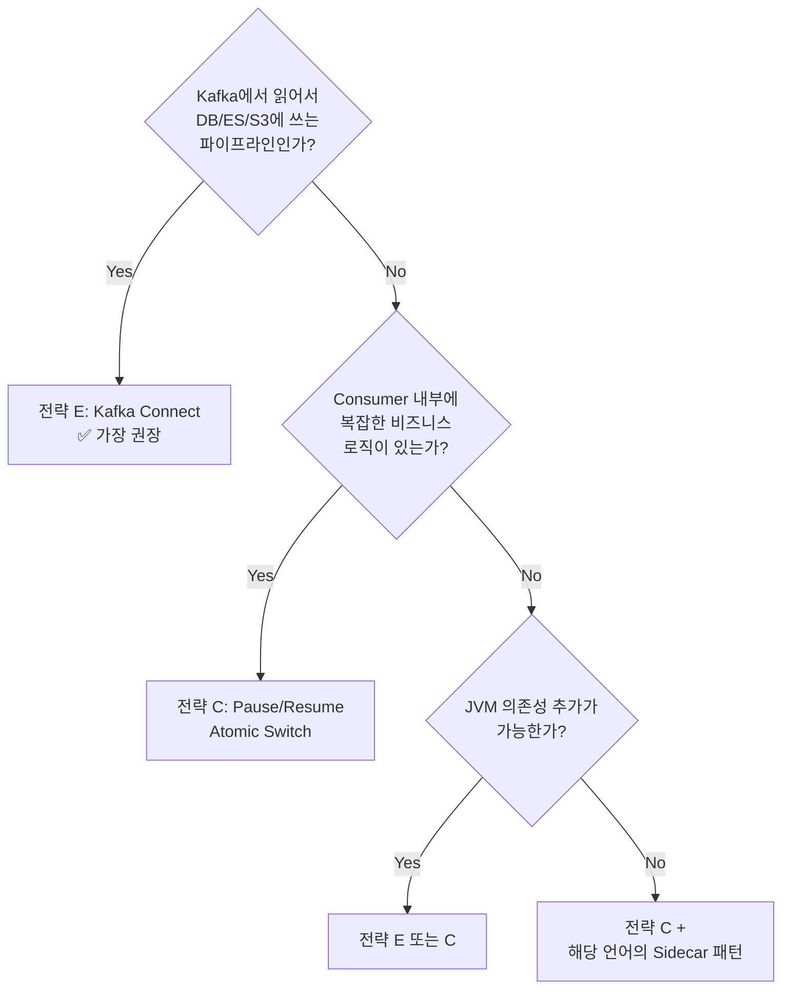

### 15.4 권장 적용 순서

```
=== 전략 E 경로 (Kafka Connect 워크로드) ===

Phase 1: Kafka Connect 환경 구축
         ├─ Strimzi Operator 또는 Confluent Platform 설치
         ├─ Blue/Green Connect Cluster 또는 Connector 쌍 생성
         └─ Green Connector를 STOPPED 상태로 배포

Phase 2: Switch Orchestrator 개발
         ├─ REST API 기반 전환 스크립트 (bash/Python/Go)
         ├─ Offset 동기화 로직 (KIP-875)
         └─ 상태 확인 폴링 + 타임아웃 처리

Phase 3: CI/CD 연동
         ├─ Argo Rollouts prePromotionAnalysis 또는 Tekton Task
         ├─ Strimzi CRD를 통한 GitOps 전환
         └─ Prometheus 모니터링 + 자동 롤백

=== 전략 C 경로 (커스텀 Consumer 워크로드) ===

Phase 1: Consumer App에 /lifecycle 엔드포인트 추가
         ├─ pause/resume/status HTTP API
         └─ RebalanceListener에서 pause 상태 복구

Phase 2: Switch Sidecar 개발 (Shawarma 참고)
         ├─ ConfigMap/CRD 변경 감시
         └─ Consumer App에 HTTP POST 전송

Phase 3: Switch Controller 또는 CRD Operator 개발
         ├─ "Pause First, Resume Second" 오케스트레이션
         ├─ K8s Lease 기반 양쪽 동시 Active 방지
         └─ Prometheus 메트릭 연동

Phase 4: 운영 자동화
         ├─ Argo Rollouts prePromotionAnalysis 연동
         ├─ Grafana 대시보드
         └─ 롤백 자동화 (Lag 급증 시)
```

---

## 16. 참조 자료

### Kafka Connect

| 제목 | URL |
|---|---|
| Confluent - Kafka Connect 개요 | https://docs.confluent.io/platform/current/connect/index.html |
| Kafka Connect REST API 101 | https://developer.confluent.io/courses/kafka-connect/rest-api/ |
| Confluent - Monitoring Connectors (Pause/Resume) | https://docs.confluent.io/platform/current/connect/monitoring.html |
| KIP-875: First-class Offsets Support | https://cwiki.apache.org/confluence/display/KAFKA/KIP-875:+First-class+offsets+support+in+Kafka+Connect |
| KIP-980: Creating Connectors in Stopped State | https://cwiki.apache.org/confluence/display/KAFKA/KIP-980:+Allow+creating+connectors+in+a+stopped+state |
| Strimzi Proposal #054 - Stopping Connectors | https://github.com/strimzi/proposals/blob/main/054-stopping-kafka-connect-connectors.md |
| Strimzi Issue #3277 - REST API vs CRD 충돌 | https://github.com/strimzi/strimzi-kafka-operator/issues/3277 |
| Strimzi Issue #8713 - STOPPED 상태 지원 | https://github.com/strimzi/strimzi-kafka-operator/issues/8713 |
| Kafka Connect Improvements in 2.3 (Incremental Rebalancing) | https://www.confluent.io/blog/kafka-connect-improvements-in-apache-kafka-2-3/ |
| Sink Connector 개발 가이드 | https://docs.confluent.io/platform/current/connect/devguide.html |
| Why Not Write Your Own Integrations | https://developer.confluent.io/courses/kafka-connect/intro/ |

### 다국어 클라이언트

| 제목 | URL |
|---|---|
| Apache Kafka Clients Wiki | https://cwiki.apache.org/confluence/display/KAFKA/Clients |
| Kafka Client Library Comparison (Java vs KafkaJS) | https://www.lydtechconsulting.com/blog/kafka-client-apache-kafka-vs-kafkajs |
| confluent-kafka-go (librdkafka Go 바인딩) | https://github.com/confluentinc/confluent-kafka-go |
| confluent-kafka-python Issue #371 - Pause/Resume Deadlock | https://github.com/confluentinc/confluent-kafka-python/issues/371 |
| kafka-python Issue #2011 - Resume Offset Jump | https://github.com/dpkp/kafka-python/issues/2011 |
| KafkaJS Pause/Resume Issue #808 | https://github.com/tulios/kafkajs/issues/808 |
| amient/goconnect - Go Connect 프레임워크 시도 | https://github.com/amient/goconnect |

### 도구 및 프레임워크

| 제목 | URL |
|---|---|
| Shawarma - K8s Blue/Green Sidecar | https://github.com/CenterEdge/shawarma |
| Shawarma Webhook (MutatingAdmission) | https://github.com/CenterEdge/shawarma-webhook |
| Shawarma 블로그 | https://btburnett.com/kubernetes/microservices/continuous%20delivery/2019/08/12/shawarma.html |
| Argo Rollouts Blue/Green | https://argo-rollouts.readthedocs.io/en/stable/features/bluegreen/ |
| Argo Rollouts Concepts | https://argo-rollouts.readthedocs.io/en/stable/concepts/ |
| KEDA Kafka Scaler + Argo Rollouts 연동 | https://keda.sh/blog/2020-11-04-keda-2.0-release/ |

### 사례 연구

| 제목 | URL |
|---|---|
| Expedia - Kafka Blue/Green Deployment | https://medium.com/expedia-group-tech/kafka-blue-green-deployment-212065b7fee7 |
| Airwallex - Kafka Streams Blue/Green | https://medium.com/airwallex-engineering/kafka-streams-iterative-development-and-blue-green-deployment-fae88b26e75e |
| Feature Flag + Kafka Pause/Resume | https://www.improving.com/thoughts/unleashing-feature-flags-onto-kafka-consumers/ |
| Lyft Blackhole Sink Pattern | https://www.streamingdata.tech/p/blackhole-sink-pattern-for-blue-green |
| Cloudflare - Kafka Consumer Health | https://blog.cloudflare.com/intelligent-automatic-restarts-for-unhealthy-kafka-consumers/ |

### 기술 사양 및 KIP

| 제목 | URL |
|---|---|
| KIP-345 Static Membership | https://cwiki.apache.org/confluence/display/KAFKA/KIP-345 |
| KIP-848 새로운 Rebalance 프로토콜 (Kafka 4.0+) | https://karafka.io/docs/Kafka-New-Rebalance-Protocol/ |
| Confluent - Cooperative Rebalancing | https://www.confluent.io/blog/cooperative-rebalancing-in-kafka-streams-consumer-ksqldb/ |
| Kafka 4.0 Next Gen Rebalance Protocol | https://www.instaclustr.com/blog/rebalance-your-apache-kafka-partitions-with-the-next-generation-consumer-rebalance-protocol/ |
| Red Hat - Kafka Pause/Resume | https://developers.redhat.com/articles/2023/12/01/how-avoid-rebalances-and-disconnections-kafka-consumers |
| Confluent - Kafka Rebalancing 상세 설명 | https://www.confluent.io/learn/kafka-rebalancing/ |
| K8s 환경 Kafka Static Membership 활용 | https://medium.com/bakdata/solving-my-weird-kafka-rebalancing-problems-c05e99535435 |

### 이슈 트래커

| 제목 | URL |
|---|---|
| Spring Kafka #2222 - Rebalance Pause 유실 | https://github.com/spring-projects/spring-kafka/issues/2222 |
| Spring Kafka #2277 - Rebalance Protocol 호환성 | https://github.com/spring-projects/spring-kafka/issues/2277 |
| Argo Rollouts #3539 - Kafka Consumer Scale | https://github.com/argoproj/argo-rollouts/issues/3539 |
| Confluent Kafka Go #193 - Pause After Rebalance | https://github.com/confluentinc/confluent-kafka-go/issues/193 |
| KAFKA-13291 - Stateful Blue/Green | https://issues.apache.org/jira/browse/KAFKA-13291 |
| ASF JIRA KAFKA-2350 - Pause/Resume API 설계 배경 | https://issues.apache.org/jira/browse/KAFKA-2350 |
| Micronaut Kafka Issue #19 | https://github.com/micronaut-projects/micronaut-kafka/issues/19 |

### 기타

| 제목 | URL |
|---|---|
| Blue/Green Deployment Strategy for Kafka (특허) | https://www.tdcommons.org/dpubs_series/6318/ |
| Spring Kafka Pause/Resume 블로그 | https://medium.com/@akhil.bojedla/start-stop-pause-and-resume-spring-kafka-consumer-at-runtime-45b44b9be44b |
| DZone - Stop & Resume Kafka | https://dzone.com/articles/ways-to-stop-amp-resume-your-kafka-producerconsume |
| Confluent - Consumer Group IDs | https://www.confluent.io/blog/configuring-apache-kafka-consumer-group-ids/ |

---

*본 설계서는 참조 문서 및 실제 운영 사례를 기반으로 작성되었으며, 실제 환경 적용 전 스테이징 검증을 권장합니다.*
