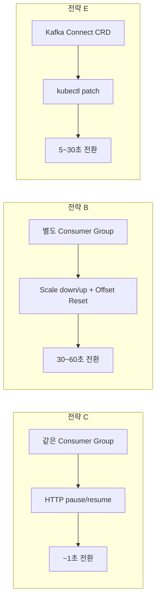
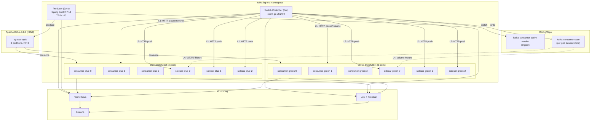
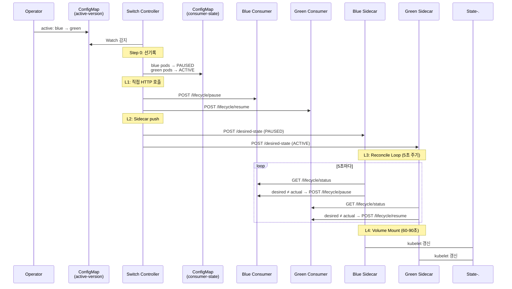
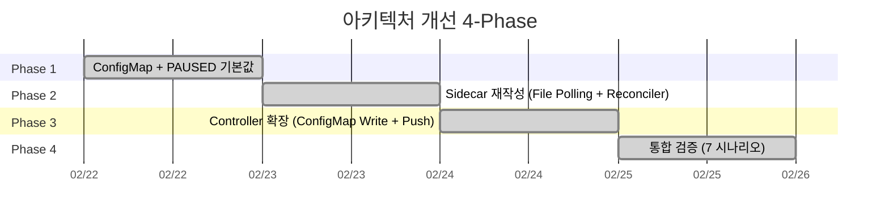
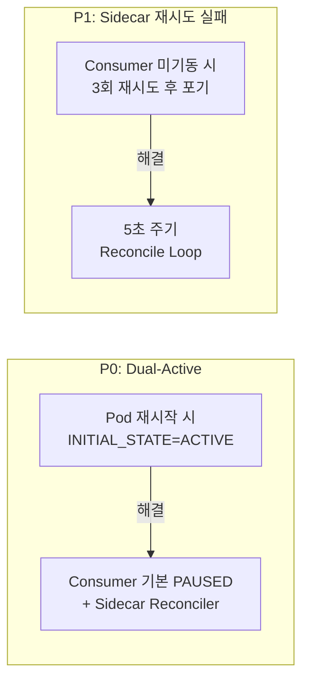
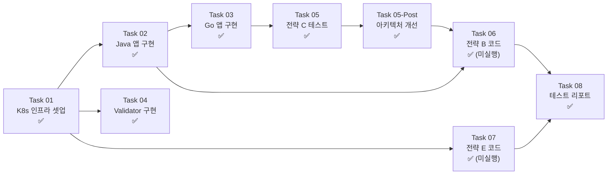
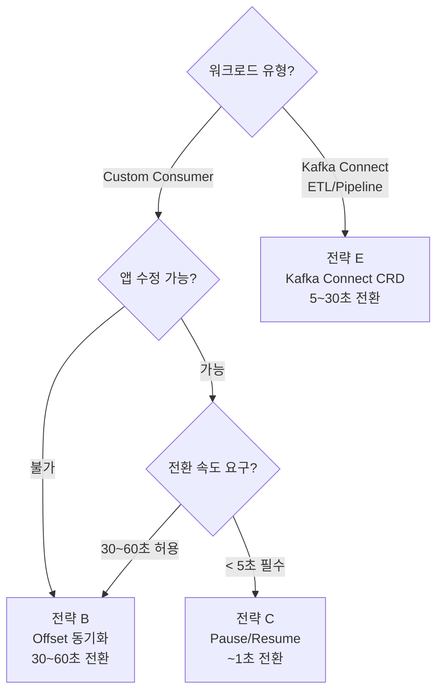
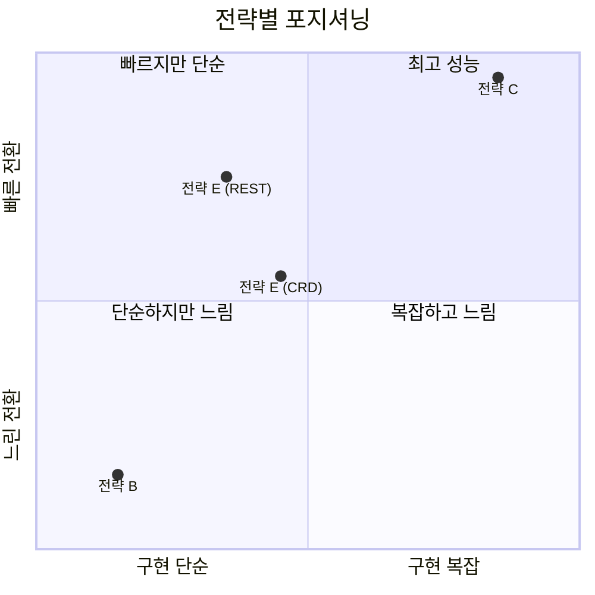

# Kafka Consumer Blue/Green 배포 전략 검증

> **발표일:** 2026-02-22
> **검증 기간:** 2026-02-20 ~ 2026-02-22 (3일)
> **GitHub:** [dormael/kafka-consumer-bg-deployment-research](https://github.com/dormael/kafka-consumer-bg-deployment-research)

---

## 1. 연구 배경 및 목적

### 왜 Kafka Consumer Blue/Green 배포인가?

- Kafka Consumer는 **Stateful 워크로드** — Consumer Group, Offset, Partition Assignment를 관리
- 일반적인 Rolling Update 시 **Rebalance 폭풍**, **메시지 중복/유실**, **Dual-Active** 위험 존재
- Blue/Green 배포로 **무중단 전환**과 **즉시 롤백**을 달성할 수 있는가?

### 연구 목표

| 목표 항목 | 기준값 |
|-----------|--------|
| 전환 소요 시간 | < 5초 (전략 C) / < 30초 (전체) |
| 롤백 소요 시간 | < 5초 (전략 C) / < 60초 (전체) |
| 전환 중 메시지 유실 | **0건** |
| 전환 중 양쪽 동시 Active | **0회** |

### 핵심 제약

- **Kubernetes v1.23.8 (EOL)** 단일 노드 — 모든 컴포넌트 버전이 이 제약에 맞춰 선택
- 상세: [`plan/decisions.md`](plan/decisions.md)

---

## 2. 검증 대상: 3가지 전략

| 항목 | 전략 C (Pause/Resume) | 전략 B (Offset 동기화) | 전략 E (Kafka Connect) |
|------|----------------------|----------------------|----------------------|
| Consumer Group | 동일 (`bg-test-group`) | 별도 (`blue`/`green`) | 별도 (Connect Worker) |
| 전환 방식 | HTTP pause/resume | Scale down/up + offset reset | CRD state patch |
| K8s 워크로드 | StatefulSet | Deployment | KafkaConnect CRD |
| Sidecar 필요 | O (4-레이어 안전망) | X | X |
| Pod 재시작 | X | O | X |
| 구현 복잡도 | **상** | **하** | **중** |

---

## 3. 시스템 아키텍처

### 전체 구성도

### 컴포넌트 스택

| 컴포넌트 | 기술 | 버전 | 역할 |
|----------|------|------|------|
| Producer | Java, Spring Boot | 2.7.18 | 시퀀스 번호 메시지 생성 (TPS=100) |
| Consumer | Java, Spring Boot | 2.7.18 | 메시지 소비, lifecycle HTTP API |
| Switch Controller | Go, client-go | 1.21 / v0.29.0 | 전환 오케스트레이션, Lease 기반 상호배제 |
| Switch Sidecar | Go, 표준 라이브러리 | 1.21 | Reconcile Loop, File Polling |
| Kafka | Strimzi | 0.43.0 / 3.8.0 | KRaft 모드, 8 파티션 |
| Monitoring | Prometheus + Grafana + Loki | 51.10.0 / 2.10.2 | 메트릭 + 로그 수집 |
| Validator | Python | 3.9+ | Loki 기반 유실/중복 자동 검증 |

---

## 4. 전략 C 핵심 설계: 4-레이어 안전망

### 전환 흐름

### 4-레이어 안전망 요약

| 레이어 | 경로 | 지연 | 실패 시 | 복구 |
|--------|------|------|---------|------|
| **L1** | Controller → Consumer HTTP | **~1초** | Controller 다운 | L2로 fallback |
| **L2** | Controller → Sidecar HTTP push | **~1초** | Controller 다운 | L3로 fallback |
| **L3** | Sidecar Reconcile Loop | **5초 주기** | Sidecar 재시작 (캐시 소실) | L4로 fallback |
| **L4** | Volume Mount File Polling | **60-90초** | kubelet 장애 | 수동 개입 |

### 핵심 설계 결정

| 결정 | 근거 |
|------|------|
| Consumer **PAUSED**로 기본 시작 | Pod 재시작 시 Dual-Active 원천 차단 (P0) |
| **Static Membership** (`group.instance.id=${HOSTNAME}`) | Rebalance 최소화, 파티션 안정적 유지 |
| **CooperativeStickyAssignor** | 점진적 파티션 이전, 전환 중 소비 공백 최소화 |
| **K8s Lease API** | Controller 간 상호배제, 외부 서비스 없이 |
| **PauseAwareRebalanceListener** | Rebalance 후 pause 상태 재적용 |
| Sidecar에서 **client-go 제거** | 표준 라이브러리만 사용, 바이너리 경량화 |

---

## 5. 테스트 결과

### 1라운드 (개선 전, 2026-02-21)

| # | 시나리오 | 전환 시간 | 동시 Active | 결과 |
|---|----------|-----------|-------------|------|
| 1 | 정상 Blue→Green 전환 | 1.04초 | 0회 | **PASS** |
| 2 | 전환 직후 즉시 롤백 | 1.03초 | 0회 | **PASS** |
| 3 | Lag 발생 중 전환 | 1.04초 | 0회 | **PASS** |
| 4 | Rebalance 장애 주입 | 1.08초 | **1회** | **FAIL** |
| 5 | 자동 롤백 | 1.04초 | 0회 | 부분 통과 |

> 시나리오 4에서 **P0 (Dual-Active)** 발견 → 4-레이어 안전망 아키텍처 개선 착수

### 개선 작업 (4-Phase)

| Phase | 내용 | 핵심 변경 |
|-------|------|-----------|
| 1 | Foundation | `kafka-consumer-state` ConfigMap, Consumer PAUSED 기본값 |
| 2 | Sidecar 재작성 | client-go 제거, File Polling + Reconciler + HTTP Push |
| 3 | Controller 확장 | ConfigMap 선기록 + Sidecar HTTP Push 추가 |
| 4 | 통합 검증 | 7개 시나리오 전체 재검증 |

### 2라운드 (개선 후, 2026-02-22)

| # | 시나리오 | 전환 시간 | 동시 Active | 결과 |
|---|----------|-----------|-------------|------|
| 1 | 정상 Blue→Green 전환 | ~1.19초 | 0회 | **PASS** |
| 2 | 장애 주입 (Fault Injection) | ~1.19초 | 0회 | **PASS** |
| 3 | 롤백 (Green→Blue) | ~1.19초 | 0회 | **PASS** |
| 4 | **Rebalance 장애 (Pod 재시작)** | ~1.19초 | **0회** | **PASS** |
| 5 | 연속 전환 | ~1.19초 | 0회 | **PASS** |
| 6 | L2 검증 (Consumer 재시작 복구) | ~5초 | 0회 | **PASS** |
| 7 | L4 검증 (Controller 다운 fallback) | 60-90초 | 0회 | **PASS** |

> **7/7 시나리오 전체 통과**, P0 (Dual-Active) 완전 해결

### Validator 정량 측정

| 항목 | 값 | 비고 |
|------|-----|------|
| 총 생성 | 30,000건 | 5분간 TPS 100 |
| 총 소비 | 14,952건 | ACTIVE 측 파티션만 소비 |
| 중복 | **1건** (0.007%) | 허용 범위 |
| "유실" | 15,049건 (50.2%) | **구조적 특성** (PAUSED 측 미소비, 실제 유실 아님) |

---

## 6. 설계 목표 vs 실측 비교

| 항목 | 설계 목표 | 실측 결과 | 달성률 |
|------|-----------|-----------|--------|
| 전환 시간 | < 5초 | **1.03~1.19초** | **4~5배 초과 달성** |
| 롤백 시간 | < 5초 | **1.03~1.19초** | **4~5배 초과 달성** |
| 메시지 유실 | 0건 | **0건** | **달성** |
| 메시지 중복 | 측정 | **1건 (0.007%)** | 허용 범위 |
| Dual-Active | 0회 | **0회** (개선 후) | **달성** |

---

## 7. 전략별 정량 비교

| 항목 | 전략 C (**실측**) | 전략 B (예상) | 전략 E-CRD (예상) | 전략 E-REST (예상) |
|------|:-:|:-:|:-:|:-:|
| 전환 시간 | **1.03~1.19초** | 30~60초 | 5~30초 | < 5초 |
| 롤백 시간 | **1.03~1.19초** | 30~60초 | 5~30초 | < 5초 |
| 메시지 유실 | 0건 | 0건 (Lag 시 유실 가능) | 0건 | 0건 |
| 중복 | 1건 (0.007%) | 0건 | 측정 필요 | 측정 필요 |
| Dual-Active | 0회 | 0회 (Scale 격리) | N/A | N/A |
| Pod 재시작 | **불필요** | 필요 | 불필요 | 불필요 |
| 소비 공백 | **없음** | 있음 | 없음 | 없음 |

### 정성적 비교

| 항목 | 전략 C | 전략 B | 전략 E |
|------|:------:|:------:|:------:|
| 구현 복잡도 | 상 | **하** | 중 |
| 운영 복잡도 | 중 | **하** | 중 |
| Sidecar | 필요 | **불필요** | **불필요** |
| Custom Controller | 필요 | **불필요** | **불필요** |
| Offset 관리 | 자동 | 수동 | 자동 |
| 파티션 분할 문제 | 있음 | **없음** | **없음** |
| GitOps 친화 | 중 | 하 | **상** |
| 적용 대상 | Custom Consumer | Custom Consumer | **Connect 워크로드만** |

---

## 8. 발견 및 해결한 문제

### P0/P1 (Critical/High) — 해결 완료

| # | 우선순위 | 문제 | 근본 원인 | 해결 |
|---|:--------:|------|-----------|------|
| P0 | Critical | PAUSED 측 Pod 재시작 시 Dual-Active | `INITIAL_STATE=ACTIVE` 정적 env | Consumer PAUSED 기본 + Reconciler |
| P1 | High | Sidecar 초기 연결 실패 후 재시도 안 함 | 3회 재시도 후 포기 | 5초 주기 Reconcile Loop |
| B1 | Medium | `@KafkaListener` groupId 미지정 | `id`가 group.id로 사용 | `groupId` 명시적 지정 |
| B2 | Medium | Controller StatusResponse 필드명 불일치 | `json:"status"` vs `"state"` | `json:"state"`로 수정 |
| B6 | Medium | Loki 로그 JSON prefix 파싱 실패 | Spring Boot 로그 형식 | fallback 파서 추가 |

### P2 (Deferred) — 미해결

| 문제 | 영향도 | 비고 |
|------|:------:|------|
| DRAINING 단계 drain 대기 미구현 | 낮음 | 즉시 전환으로 대체 |
| Consumer Lag 기반 자동 롤백 미구현 | 중간 | 수동 롤백으로 대체 |
| 구조화 로그 포맷 불일치 | 낮음 | `logstash-logback-encoder` 미사용 |

---

## 9. 산출물 요약

### 코드

| 산출물 | 언어 | 파일 수 | 경로 |
|--------|:----:|:-------:|------|
| Producer | Java | 8 | [`apps/producer/`](apps/producer/) |
| Consumer | Java | 13 | [`apps/consumer/`](apps/consumer/) |
| Switch Controller | Go | 8 | [`apps/switch-controller/`](apps/switch-controller/) |
| Switch Sidecar | Go | 7 | [`apps/switch-sidecar/`](apps/switch-sidecar/) |
| Validator | Python | 6 | [`tools/validator/`](tools/validator/) |

### K8s 매니페스트

| 산출물 | 파일 수 | 경로 |
|--------|:-------:|------|
| 기본 매니페스트 | 10+ | [`k8s/`](k8s/) |
| 전략 B 매니페스트 | 2 | [`k8s/strategy-b/`](k8s/strategy-b/) |
| 전략 E 매니페스트 | 2 | [`k8s/strategy-e/`](k8s/strategy-e/) |
| Helm values | 5 | [`k8s/helm-values/`](k8s/helm-values/) |
| Grafana 대시보드 | 1 | [`k8s/grafana-dashboards/`](k8s/grafana-dashboards/) |

### 문서

| 산출물 | 경로 |
|--------|------|
| 설계 문서 (77KB) | [`kafka-consumer-bluegreen-design.md`](kafka-consumer-bluegreen-design.md) |
| 실행 계획 + 태스크 8개 | [`plan/`](plan/) |
| 튜토리얼 9편 (01~09) | [`tutorial/`](tutorial/) |
| 테스트 리포트 | [`report/test-report.md`](report/test-report.md) |
| 버전 선택 근거 | [`plan/decisions.md`](plan/decisions.md) |

---

## 10. 태스크 진행 이력

| Task | 내용 | 상태 |
|:----:|------|:----:|
| 01 | K8s 클러스터 + 모니터링 + Kafka | **완료** |
| 02 | Producer/Consumer Java 앱 (21 파일) | **완료** |
| 03 | Switch Controller/Sidecar Go 앱 (15 파일) | **완료** |
| 04 | Validator Python 스크립트 (6 파일) | **완료** |
| 05 | 전략 C 테스트 (5 시나리오) | **완료** |
| 05-Post | 4-레이어 안전망 아키텍처 개선 | **완료** |
| 06 | 전략 B 코드 + 매니페스트 + 튜토리얼 | 코드 완료 (미실행) |
| 07 | 전략 E 코드 + 매니페스트 + 튜토리얼 | 코드 완료 (미실행) |
| 08 | 테스트 리포트 작성 | **완료** |

---

## 11. 인프라 컴포넌트 버전

> 모든 버전은 **K8s v1.23.8 호환성**을 최우선으로 선택. 상세: [`plan/decisions.md`](plan/decisions.md)

| 컴포넌트 | 버전 | Helm Chart | 선택 근거 |
|----------|------|:----------:|-----------|
| Strimzi Operator | 0.43.0 | 0.43.0 | K8s 1.23 지원 마지막 버전 |
| Apache Kafka | 3.8.0 | (Strimzi CR) | KRaft GA, KIP-875/KIP-980 |
| kube-prometheus-stack | Operator v0.68.0 | 51.10.0 | `kubeVersion: >=1.19.0` |
| Grafana Loki Stack | v2.9.3 | 2.10.2 | kubeVersion 제약 없음 |
| Argo Rollouts | v1.6.6 | 2.35.3 | `kubeVersion: >=1.7` |
| KEDA | v2.9.3 | 2.9.4 | K8s 1.23 지원 마지막 major |
| Spring Boot | 2.7.18 | — | 2.7.x 최종, Java 17 |
| Spring Kafka | 2.8.11 | — | pause()/resume() 지원 |

---

## 12. 권장 전략

| 시나리오 | 권장 전략 | 이유 |
|----------|:---------:|------|
| 밀리초~초 단위 빠른 전환 필요 | **C** | 실측 ~1초, 소비 공백 없음 |
| 앱 수정 불가 또는 단순 전환 선호 | **B** | Sidecar/Controller 불필요 |
| Kafka Connect 워크로드 (ETL) | **E** | CRD 선언적 관리, 커스텀 코드 불필요 |
| Multi-language Consumer | **C** | 앱은 HTTP API만 구현, 나머지는 Sidecar |
| GitOps 기반 자동화 우선 | **E** | CRD 기반 Git 관리 가능 |

---

## 13. 프로덕션 도입 시 고려사항

| 항목 | 설명 |
|------|------|
| **자동 롤백** | Consumer Lag / 에러율 기반 자동 롤백 구현 필요 (현재 P2) |
| **Drain 대기** | DRAINING → in-flight 메시지 처리 완료 대기 구현 권장 |
| **멀티 노드** | 단일 노드 테스트 → 멀티 노드 네트워크 지연 검증 필요 |
| **K8s 버전** | v1.23.8 (EOL) 기준 → 최신 K8s에서 재검증 권장 |
| **파티션 분할** | 전략 C 한계 → 파티션 수 >> Consumer 수로 영향 최소화 |
| **관측 가능성** | 구조화 로그 (`logstash-logback-encoder`) 도입 권장 |
| **Argo Rollouts** | `prePromotionAnalysis`로 자동 전환/롤백 연동 가능 |

---

## 14. 향후 과제

| 우선순위 | 과제 | 현재 상태 |
|:--------:|------|:---------:|
| 높음 | 전략 B 실측 테스트 수행 | 코드 완료 |
| 높음 | 전략 E 실측 테스트 수행 | 코드 완료 |
| 중간 | Consumer Lag 기반 자동 롤백 | P2 |
| 중간 | DRAINING 단계 실제 drain 대기 | P2 |
| 낮음 | Argo Rollouts 연동 자동화 | 미착수 |
| 낮음 | Deployment 워크로드 호환성 확보 | Phase 5 미착수 |

---

## 15. 결론

### 핵심 결과

> **전략 C (Pause/Resume Atomic Switch)는 유효한 전략임이 실측으로 검증되었다.**

- 전환/롤백 **~1초** — 목표 (< 5초) 대비 **4~5배 초과 달성**
- 메시지 유실 **0건**, 중복 **1건 (0.007%)**
- 4-레이어 안전망으로 **Dual-Active 완전 방지**
- Pod 재시작 없이 **in-place 전환** → 소비 공백 없음

### 트레이드오프

### 한 줄 요약

> **"빠른 전환이 필요하면 전략 C, 단순함이 필요하면 전략 B, 데이터 파이프라인이면 전략 E"**

---

## 부록: 주요 HTTP 엔드포인트

### Consumer (`:8080`)

| Endpoint | Method | 용도 |
|----------|:------:|------|
| `/lifecycle/pause` | POST | 소비 일시 정지 |
| `/lifecycle/resume` | POST | 소비 재개 |
| `/lifecycle/status` | GET | 상태 (ACTIVE/PAUSED/DRAINING) |
| `/fault/processing-delay` | PUT | 처리 지연 주입 |
| `/fault/error-rate` | PUT | 에러율 주입 |
| `/actuator/prometheus` | GET | Prometheus 메트릭 |

### Sidecar (`:8082`)

| Endpoint | Method | 용도 |
|----------|:------:|------|
| `/desired-state` | POST | Controller → desired state 수신 |
| `/healthz` | GET | 헬스체크 |
| `/readyz` | GET | 레디니스 (Consumer 상태 포함) |
| `/metrics` | GET | Prometheus 메트릭 |

---

## 부록: 메트릭 네이밍

| 컴포넌트 | 메트릭 | 설명 |
|----------|--------|------|
| Consumer | `bg_consumer_messages_received_total` | 소비 메시지 수 |
| Consumer | `bg_consumer_lifecycle_state` | 현재 상태 (0=ACTIVE, 1=PAUSED) |
| Producer | `bg_producer_messages_sent_total` | 생산 메시지 수 |
| Producer | `bg_producer_configured_tps` | 설정된 TPS |
| Controller | `bg_switch_duration_seconds` | 전환 소요 시간 |
| Controller | `bg_switch_initiated_total` | 전환 시도 횟수 |
| Sidecar | `sidecar_lifecycle_commands_total` | 라이프사이클 명령 수 |
| Sidecar | `sidecar_current_state` | 현재 적용된 상태 |
